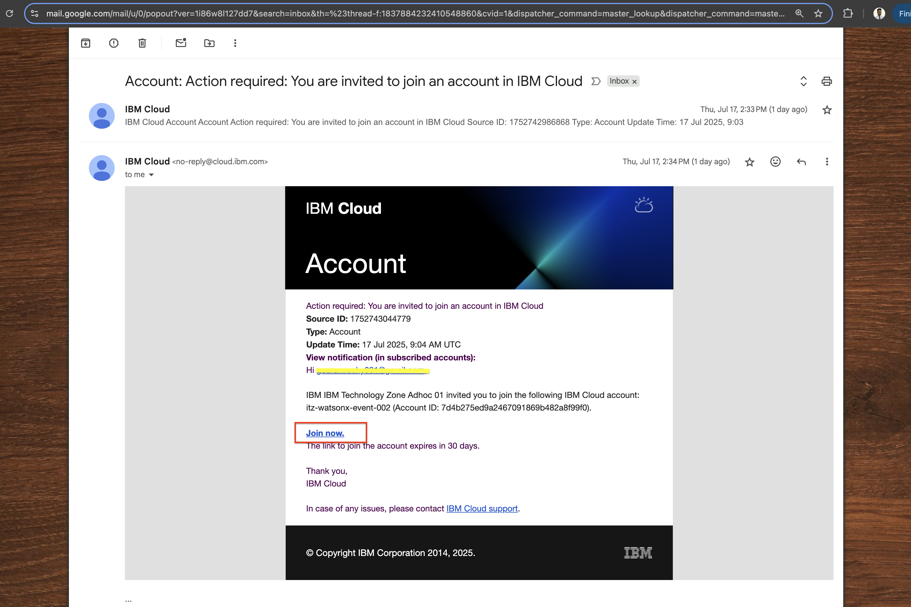

# Lab:0 - IBM Cloud Setup

🎯 Objective
This pre-work lab is intended to set up the foundational IBM Cloud credentials required for the bootcamp. You’ll generate and securely store the following mandatory credentials:

- API Key

- Project ID

- Space ID

These values are essential for running various hands-on exercises and labs throughout the bootcamp. Follow the below steps to create the above. 

## Step-1: Create IBMid account (if not created) 

If you've not created your IBM cloud account, please refer the link and create your IBM account with your corporate email id that you have provided us in the registration

[Create IBMid account](https://www.ibm.com/docs/en/ibmid?topic=introduction)

## Step-2: Go to your email ID and join the IBM cloud account. 

## Step-3: After login, this is how your IBM cloud account looks like. 

