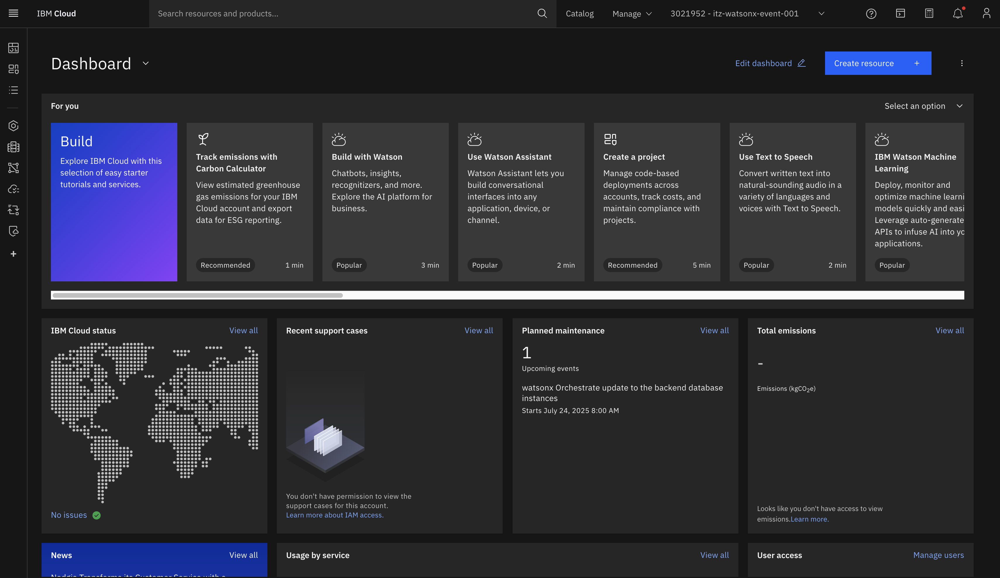
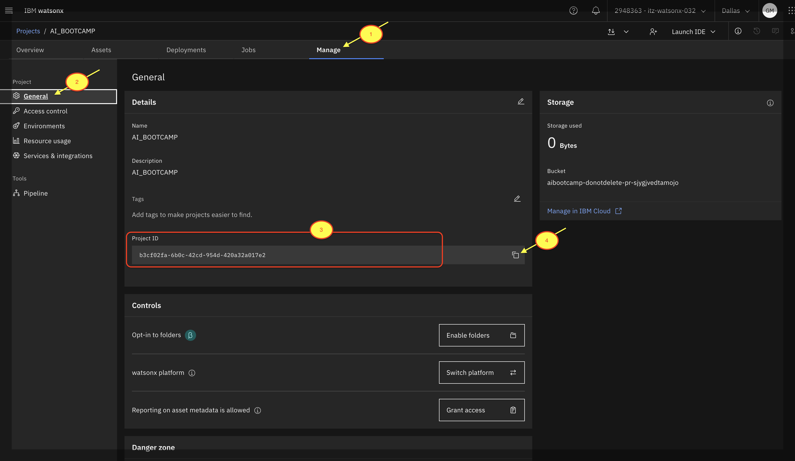

# Lab:0 - IBM Cloud Setup

🎯 Objective
This pre-work lab is intended to check whether you've created the IBM cloud environment properly or not. 

These values are essential for running various hands-on exercises and labs throughout the bootcamp. Follow the below steps to create the above. 

## Step-1: Create IBMid account (if not created) 

If you've not created your IBM cloud account, please refer the link and create your IBM account with your corporate email id that you have provided us in the registration

[Create IBMid account](https://www.ibm.com/docs/en/ibmid?topic=introduction)

## Step-2: Go to your email ID and join the IBM cloud account. 

## Step-3: After login, this is how your IBM cloud account looks like. 

**Important:**: You can continue the remaining steps later after the bootcamp if you intend to run the Business Automation lab. For the workshop, you only need to complete Step 1, 2 and 3 listed above.

## Optional - Will be only useful for - [Business automation for Competitive Analysis](Lab-1:Usecases/business-automation)

## Step-4: Create API Key 

1. Go to - "Manage" > "Access (IAM)"

2. Click on - "API keys" > "Create"

3. Give a "Name" and "Description" to the API key and click on "Create"

4. API key is successfully created. **You copy it and save it or download it.**

## Step-5: Create Project in watsonx.ai 

1. Click on the **Hamburger Menu**

2. Click on "Resource list" 

3. Under "AI / Machine learning", you can see 4 options. Click on the one with "watsonx.ai Runtime" 

4. Under "Launch in", click on **"IBM watsonx"**

5. Now you'll be navigated to watsonx sudio. It's time to login with your email ID, which has IBM cloud access (from Step-1). 

6. Once logged in, click on the "Hamburger menu" in the top left corner 

7. Click on "View all projects"

8. Click on "New project"

9. Give a "Name", "Description (Optional)", "Tags (Optional)", and then go to define storage. 

10. Select a storage, and then click on "Create". Now your project is created. 

11. Click on "Manage" > "Services and integrations" > "Associate service". (This step is to associate machine learning services to the project)

12. Check mark on the "watsonx.ai Runtime" service. If you don't see the service, add all the regions in the filter.

13. Now you can see wml (Watsonx Machine Learning) service is associated with the project. 

14. Go to "Manage" > "General". Now you can see your "Project ID". **Copy it and save it**. 

## Step-6: Create Deployment space watsonx.ai 

1. Click on the "Hamburge menu" (Top left corner). 

2. Click on "View all deployment spaces" 

3. Click on "New deployment space" 

4. Now you mention a name to your deployment space. And "Deployment stage" should be "Development". 

5. Select watsonx.ai Runtime (Optional). 

6. Now it'll take a while to create the deployment space. 

7. Now your deployment space is created. 

8. Click on "Manage" > "General" and then copy "Space GUID". **Copy it and save it in your note". 

## 🔔 Note - By the end of this exercise, ensure you have securely saved the following credentials:
1. API Key
2. Project ID
3. Space ID

These credentials will be required at multiple stages throughout this bootcamp, so keep them handy for future use.

