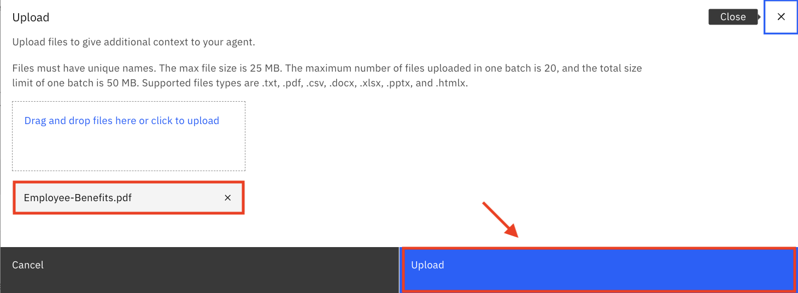
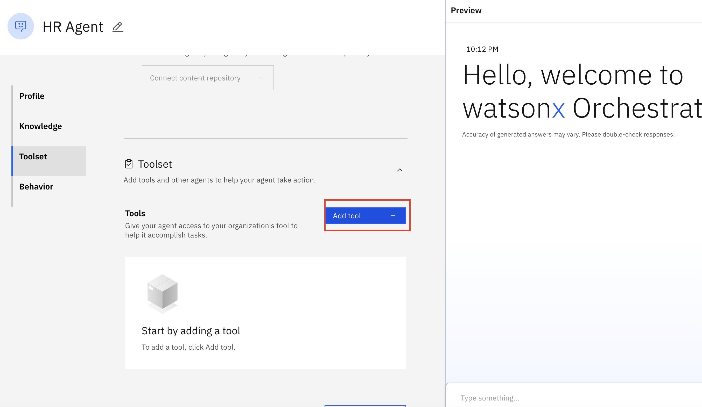
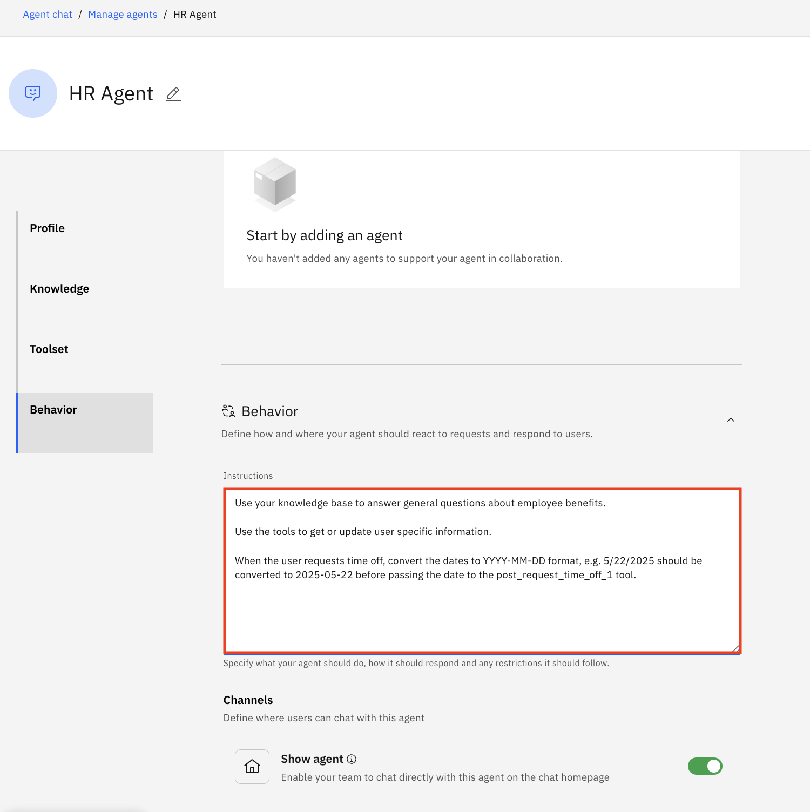
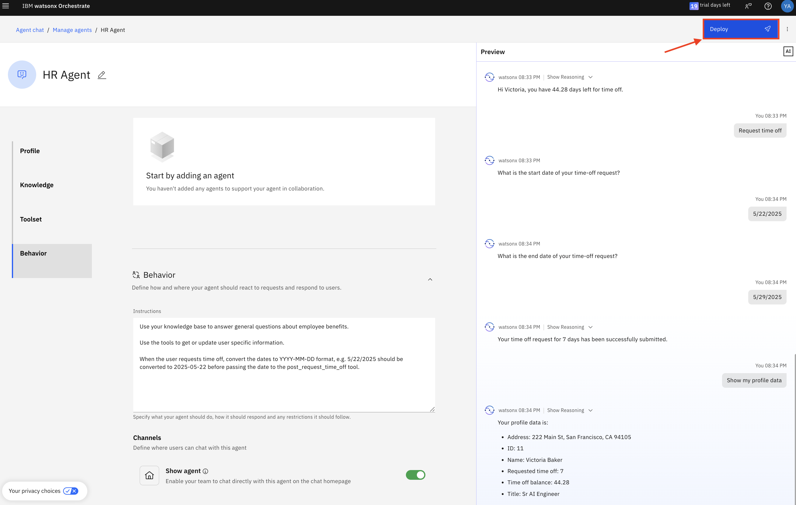
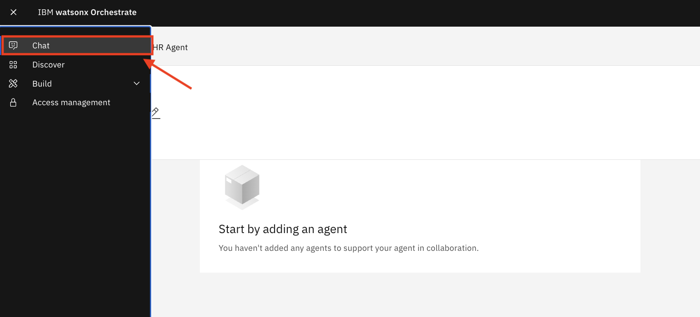

# 🧑‍💼 AskHR: Automate HR tasks with Agentic AI

## Table of Contents

- [Use case description](#use-case-description)
- [Architecture](#architecture)
- [Pre-requisites](#pre-requisites)
- [Step by step instructions to build the HR Agent](#step-by-step-instructions-to-build-agents)
    
## Use Case Description

This use case targets developing and deploying an AskHR agent leveraging IBM watsonx Orchestrate, as depicted in the provided architecture diagram. This agent will empower employees to interact with HR systems and access information efficiently through conversational AI. 

In this lab we will build an HR agent in watsonx Orchestrate, leveraging tools and external knowledge to connect to a simulated Human Capital Management System. This agent retrieves relevant information from documents to answer user queries and  allows users to view and manage their profiles.

## Architecture


## Pre-requisites

- Check with your instructor to make sure **all systems** are up and running before you continue.
- Validate that you have access to the right techzone environment for this lab.
- Validate that you have access to a credentials file that you instructor will share with you before starting the labs.
- If you're an instructor running this lab, check the **Instructor's guides** to set up all environments and systems.


## Step by step instructions to build the HR Agent

1. When you launch watsonx Orchestrate, you'll be directed to this page. Click on the hamburger menu in the top left corner:


2. Click on the down arrow next to **Build**.  Then click on **Agent Builder**:


3. Click on **Create agent +**:


4. Select "Create from scratch", give your agent a name, e.g. "YOUR NAME - HR Agent", and fill in the description as shown below: 

```
You are an agent who handles employee HR queries.  You provide short and crisp responses, keeping the output to 200 words or less.  You can help users check their profile data, retrieve latest time off balance, update title or address, and request time off. You can also answer general questions about company benefits.
```  
Click on **Create**:


5. Scroll down the screen to the **Knowledge** section. Copy the following description into the **Knowledge Description** section:

```
This knowledge base addresses the company's employee benefits, including parental leaves, pet policy, flexible work arrangements, and student loan repayment.
```

Click on **Upload files**:


6. Drag and drop the [Employee Benefits.pdf](./assets/Employee-Benefits.pdf) and click on **Upload**:

  

7. Wait until the file has been uploaded successfully and double check that it is now shown in the Knowledge section: 

  

8. Scroll down to the **Toolset** section. Click on **Add tool +**:



9. Select **Import**:


10. Drag and drop or click to upload the **hr.yaml** file (provided to you by the instructor), then click on **Next**:

    

11. Select all the operations and click on **Done**:


12. Scroll down to the **Behavior** section. Insert the instructions below into the **Instructions** field:

```
Use your knowledge base to answer general questions about employee benefits. 

Use the tools to get or update user specific information.

When user asks to show profile data or check time off balance or update title/address or request time off for the very first time,  first ask the user for their name,  then invoke the tool and then use the same name in the whole session without asking for the name again.

When the user requests time off, convert the dates to YYYY-MM-DD format, e.g. 5/22/2025 should be converted to 2025-05-22 before passing the date to the post_request_time_off tool.
 ```

 

13. Test your agent in the preview chat on the right side by asking the following questions and validating the responses. For the names, use the data in [this excel sheet](./users_data.xlsx), and validate the agent outcome based on the data. They should look similar to what is shown in the screenshots below:

```
1. What is the pet policy? 

2. Show me my profile data.

3. I'd like to update my title. 

4. Update my address

5. What is my time off balance?

6. Request time off

7. Show my profile data.

```


14. Once you have validated the answers, click on **Deploy** in the top right corner to deploy your agent:



15. Click on the hamburger menu in the top left corner and then click on **Chat**:



16. Make sure **HR Agent** is selected. You can now test your agent:


