# 👨🏻‍💻 Use case: Financial Analyst Agent  

## Table of Contents
- [Use Case Description](#use-case-description)
- [Architecture](#architecture)
- [watsonx Orchestrate](#watsonx-orchestrate)
  - [Accessing watsonx Orchestrate](#accessing-watsonx-orchestrate)
- [Financial Analyst Agent Creation](#financial-analyst-agent-creation)
  - [Agent Configuration with Knowledge Base](#agent-configuration-with-knowledge-base)
- [Financial API Agent Creation and Configuration](#financial-api-agent-creation-and-configuration)
- [Web Search Agent Creation and Configuration](#web-search-agent-creation-and-configuration)
- [Pulling it together - Complete Agent Collaboration](#pulling-it-together)
- [Experience Agents in Action using watsonx Orchestrate Chat UI](#experience-agents-in-action-using-watsonx-orchestrate-chat-ui)
- [Conclusion](#conclusion)

## Use Case Description

Blue Aurum Financial plans to implement an AI-powered Financial Research Agent to support their team of financial research analysts in accelerating their research and producing high value investment opportunities. The goal is to create an AI-powered agentic solutions that supports financial research analysts in executing the following tasks:

* Parse financial reports and extract key information.
* Provide comparative analysis between different entities based on their financial reports.
* Search public information for details about an entity as well as recent news and analysts reports.
* Execute internal tools for retrieving financial metrics via APIs.
* Generate a report of the findings and analysis.

By automating these tasks, the company aims to accelerate research process to identify new opportunities for investment.

## 🏛 Architecture  <a id="architecture"></a>


## watsonx Orchestrate
As detailed in the [Solution Architecture](images/banking-fra-architecture.png), we will build and deploy the majority of the agents for the solution in watsonx Orchestrate. AI Agents are autonomous entities that can run tasks, decide and interact with their environment. In IBM watsonx Orchestrate, agents are a key component enabling the creation of complex, dynamic systems that can adapt and respond to changing conditions. 

### Accessing watsonx Orchestrate
To access watsonx Orchestrate, follow these steps:

1- If not already logged into your IBM Cloud account, navigate your preferred browser to https://cloud.ibm.com and log in with your credentials (which you used for your TechZone reservation).

2- On your IBM Cloud landing page, click the top left navigation menu (hamburger menu) and select **Resource list** (annotated with red rectangle).
*Note: If you are a member of multiple IBM Cloud accounts, make sure you are working in the correct account (annotated with red oval) which has the required services available.*
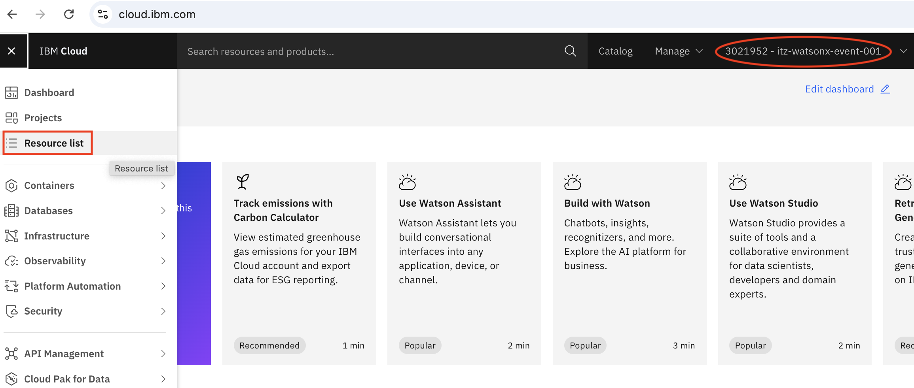 

3- On the Resource List page, expand the **AI / Machine Learning** section (annotated with red arrow), and click the **Watsonx Orchestrate** service (annotated with red rectangle) service name.
 

4- Click **Launch watsonx Orchestrate** (annotated with red arrow) to launch the service.
 

5- Once watsonx Orchestrate service is launched, you would be at its landing page as illustrated in the figure below. You will see an intuitive conversational interface with a chat field (annotated with red rectangle) where you can type any text to start interacting with watsonx Orchestrate. When you start with a new service instance, there will be no custom agents defined and thus, the section under **Agents** will state *No agents available*. You can either click **Create or Deploy** an agent under the Agents section or you can click **Create new agent** (annotated with red arrow) to start developing new agents. You can also select the **Manage agents** link to navigate to the agent management page.
Try to type a few generic questions and observe the responses from the large language model (LLM) powering the prebuilt agent in watsonx Orchestrate which ensures basic functionality until custom agents are created.
 

## Financial Analyst Agent Creation
In this section, you will go through the process of creating an AI agent in watsonx Orchestrate:

6- To start building agents, you can click the **Create new agent** link as referenced in step 5 or alternatively, click the top left navigation menu, expand the **Build** section (annotated with red arrow) and select **Agent Builder** (annotated with red rectangle). This will redirect you to the Manage agents page.
 

7- The Manage agents page will initially be blank since no agents have been created yet. As you create more and more AI agents that can reason and act, the Manage agents page will be populated with those agents. Click **Create agent** button (annotated with red arrow) to start building your first agent.
 

8- On the Create an agent page, select **Create from scratch** tile (annotated with red rectangle), provide a **Name** and a **Description** for the agent and click **Create** (annotated with red arrow).

Name: 
```
YOUR NAME - Financial Analyst Agent
```

Description: 
```
Agent skilled at financial research using internal knowledge and external search of public information.
```
The natural language description of an agent is important as it is leveraged by the agentic solution to route user messages to the right agent skilled in addressing the request. For more details, please review the [Understanding the description attribute for AI Agent](https://www.ibm.com/docs/en/watsonx/watson-orchestrate/current?topic=agents-creating#understanding-the-description-attribute-for-ai-agent) documentation.

watsonx Orchestrate supports creating an agent from scratch or from a template which involves browsing a catalog of existing agents and using attributed of another agent as a template for the new agent. For this lab, you will be creating agents from scratch.

*Note: It is recommended to review the [What are AI Agents?](https://www.ibm.com/think/topics/ai-agents) blog for some background on how AI agents work.*
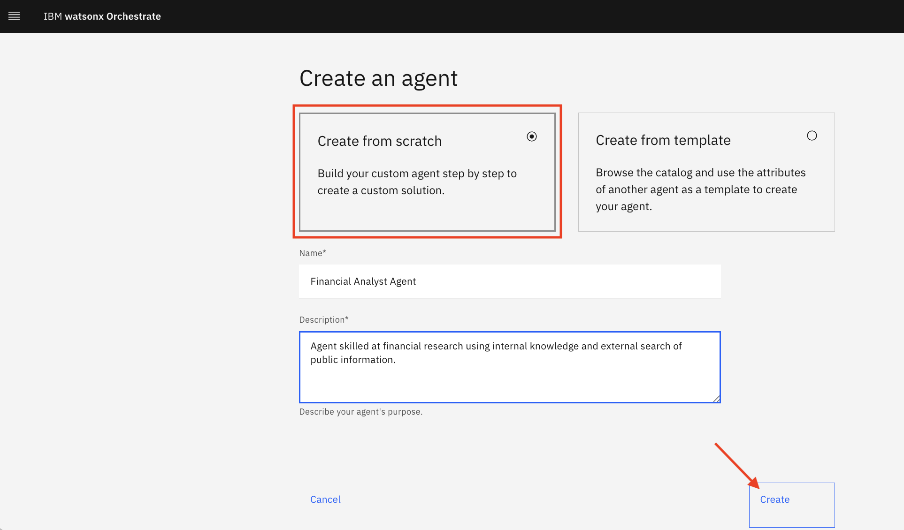 

### Agent Configuration with Knowledge Base
After the AI Agent is created, in this section, you will go through the process of configuring the agent with knowledge and tools to enable it to respond to queries using information from the knowledge base and perform tasks using the tools.

9- Next, you will go through the process of configuring your agent. The Financial Research Agent page is split in two halves. The right half is a **Preview** (annotated with red oval) chat interface that allows you to test the behavior of your agent. The left half of the page consits of four key sections (annotated with red rectangles) that you can use to configure your agent.

   - Profile: The **Profile** section consists of the description of the agent which you provided as part of creating the agent. You can always go to this section to edit and refine the description of the agent as needed.

   - Knowledge: The **Knowledge** section is where you can add knowledge to the agent. Adding knowledge to agents plays a crucial role in enhancing their conversational capabilities by providing them with the necessary information to generate accurate and contextually relevant responses for specific use cases. You can directly upload files to the agent, or connect to a Milvus or Elasticsearch instance as a content repository. Through this **Knowledge** interface, you can enable your AI agents to implement the Retrieval Augmented Generation (RAG) pattern which is a very popular AI pattern for grounding responses to a trusted source of data such as enterprise knowledge base.
   
   *Note: For more details, please consult the [Adding knowledge to agents](https://www.ibm.com/docs/en/watsonx/watson-orchestrate/current?topic=agents-adding-knowledge) documentation.*

   - Toolset: While *Knowledge* is how you empower agents with a trusted knowledge base, then **Toolset** is how you enable agents to take action by providing them with *Tools* and *Agents*. Agents can accomplish tasks by using **Tools** or can delegate tasks to other **Agents** which are deeply skilled in such tasks.

   *Note: For more details, please consult the [Adding tools to an agent](https://www.ibm.com/docs/en/watsonx/watson-orchestrate/current?topic=agents-adding-tools) and [Adding agents for orchestration](https://www.ibm.com/docs/en/watsonx/watson-orchestrate/current?topic=agents-adding-orchestration) sections of the documentation.*
   
   - Behavior: The **Behavior** section of the agent configuration is where you provide instructions to the agent to define how it responds to user requests and situations. You can configure rules that dictate when and how the agent should take action. These rules help the agent behave in a predictable and consistent manner, delivering a seamless user experience.

   *Note: For more details, please consult the [Adding instructions to agents](https://www.ibm.com/docs/en/watsonx/watson-orchestrate/current?topic=agents-adding-instructions) documentation.

Lastly, after you've completed your agent configuration and tested its performance, you can **Deploy** the agent (annotated with red arrow) to make it available through the selected channel. At this time, the main channel supported is the *Chat* home page you access when you first launched watsonx Orchestrate. The product will be adding support for additional channels where you can deploy your agent(s).

 

10- On the agent configuration page, review the *Description* of the agent in the **Profile** section and keep as is (no edits necessary). Next, scroll down to the **Knowledge** section, or click the **Knowledge** shortcut (annotated with red oval). In the Knowledge section, add a description to inform the agent about the content of the knowledge. For this lab, add the following description as we will provide the agent with a number of recent earnings reports for a handful of companies.

Description: 
```
This knowledge addresses all details about earning reports for the companies of interest. Research analysts can ask about any details from earning reports.
```

Next, you have to choose how to provide knowledge information to the agent. watsonx Orchestrate supports adding knowledge to the agent either by uploading files directly through the UI or by pointing to a content repository (Mivlus or ElasticSearch). The [Adding knowledge to agents](https://www.ibm.com/docs/en/watsonx/watson-orchestrate/current?topic=agents-adding-knowledge) documentation provides more details. For this lab, click the **Upload files** button (annotated with red arrow) to upload pdf files capturing earnings reports for AMZN, META, NVDA, and NFLX.

 


Drag and drop the following pdf files to upload to the knowledge for the agent :
   - [AMZN-Q4-2024-Earnings.pdf](documents/AMZN-Q4-2024-Earnings.pdf)
   - [META-Q4-2024-Earnings.pdf](documents/META-Q4-2024-Earnings.pdf)
   - [NFLX-Q4-2024-Earnings.pdf](documents/NFLX-Q4-2024-Earnings.pdf)
   - [NVDA-Q4-2024-Earnings.pdf](documents/NVDA-Q4-2024-Earnings.pdf)
   - [Toyota_2023_4q_summary_en.pdf](documents/Toyota_2023_4q_summary_en.pdf)

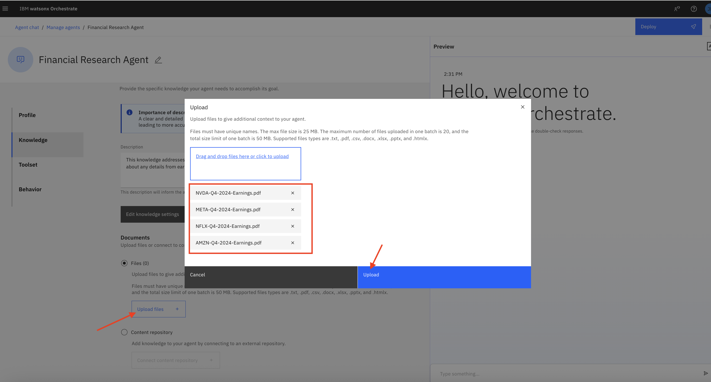 


11- Once the files are all uploaded to the knowledge base, you can start testing the agent to validate how it can respond to questions using this knowledge base. The uploaded files get processed and prepared to be leveraged by the agent. After the upload completes, test the agent by asking a few questions such as:

```Can you tell me about Meta's business```

```I'm interested in learning more about Meta and Amazon. Can you tell me a bit about their businesses?```

You should see the responses being retrieved from the uploaded documents and then the final response generated by the agent as illustrated in the figure below.

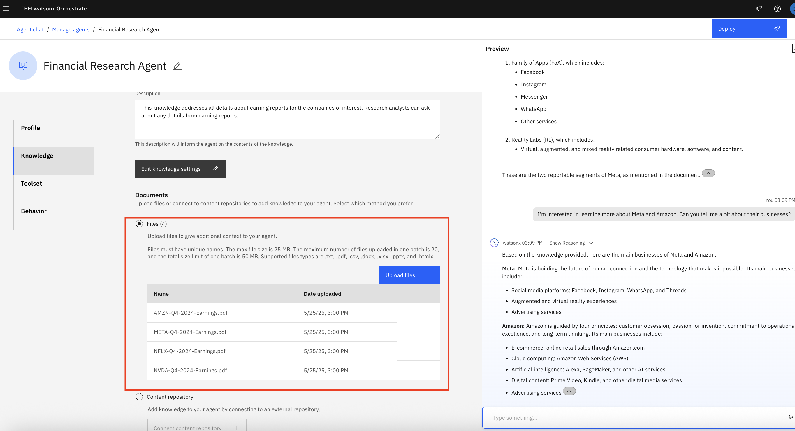 

Feel free to try a test like ```Give Toyota q4 financial results``` and review the response from the agent which should indicate that it has no information about Toyota as shown in the figure below.

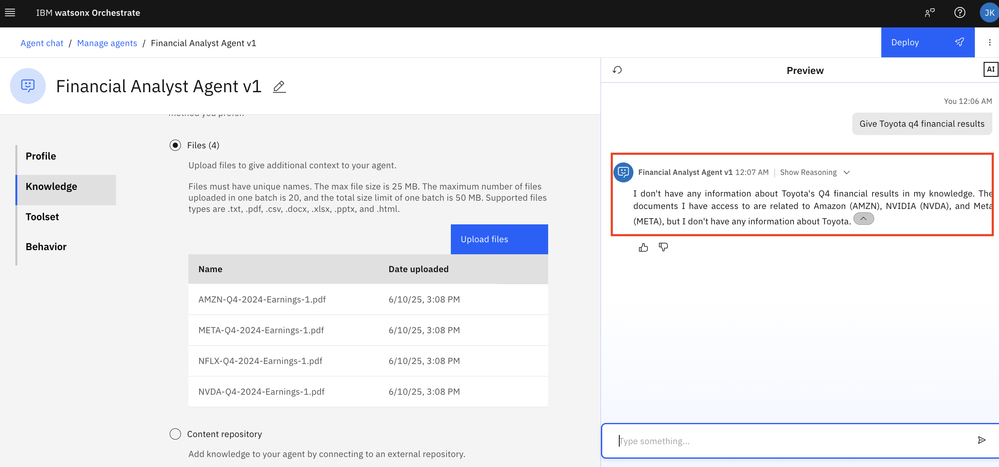 

At this time, it is worthwhile taking a moment to reflect on what you've developed so far. You have design an agent and empowered it with a knowledge base to enable it to respond to queries in context using its knowledge base. *Congratulations!!*

Reviewing the architecture, you've completed the part of the agentic solution which involved creating the Financial Analyst agent and empowering it with a knowledge base (annotated with red rectangles in the figure below). In the next section, you will work through the process of creating the **Financial API Agent** and the **Web Search Agent** which you will then add as collaborator agents to the **Financial Analyst Agent**.

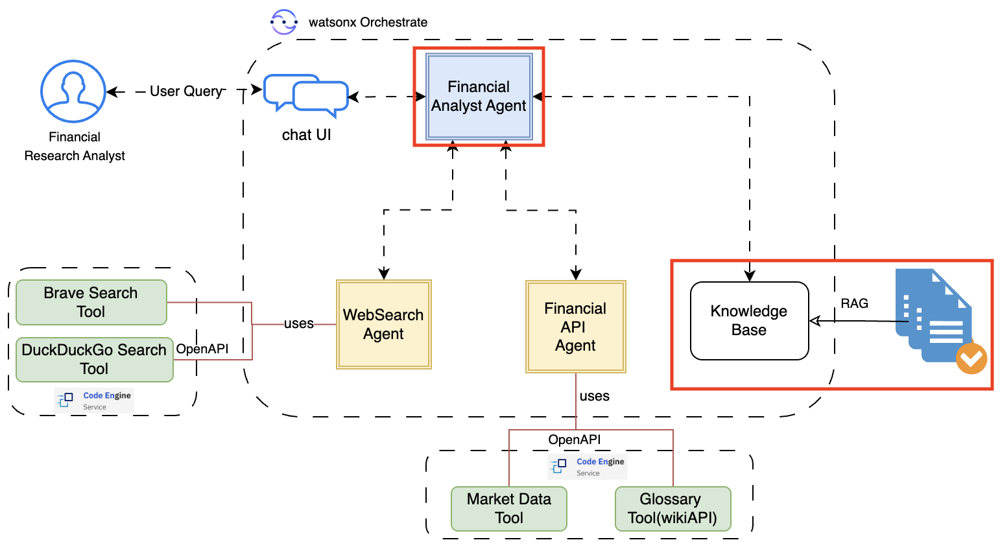 

## Financial API Agent Creation and Configuration
In this section, you will develop the Financial API Agent, one of the collaborator agents which is specifically skilled at returning market data and glossary definitions. In this hands-on lab, the Financial API Agent is empowered with two tools, the **Market Data Tool** which returns stock prices and the **Glossary Tool** which leverages Wikipedia to return glossary definitions. In practice, this agent can also get access to other internal tools such as those for modeling stock behavior or forecasting stock prices; the approach to empower the agent with such tools would be the same.

12- If you are not at the watsonx Orchestrate landing page (chat interface), repeat the steps above to make sure you are logged into IBM Cloud, find the watsonx Orchestrate service and launch it to access the landing page.

13- From the watsonx Orchestrate langding page, click **Create agent** (annotated with red rectangle) to start developing a new agent, the Financial API Agent.

 

14- On the Create an agent page, select **Create from scratch** tile , provide a **Name** and a **Description** for the agent and click **Create** (annotated with red arrow).

Name: ```YOUR NAME - Financial API Agent```

Description: 
```
Agent skilled in retrieving market data as well as glossary definitions for financial terms.
```
As explained earlier, the decription of an agent is important as it is leveraged by the agentic solution to route user messages to the right agent skilled in addressing the request.

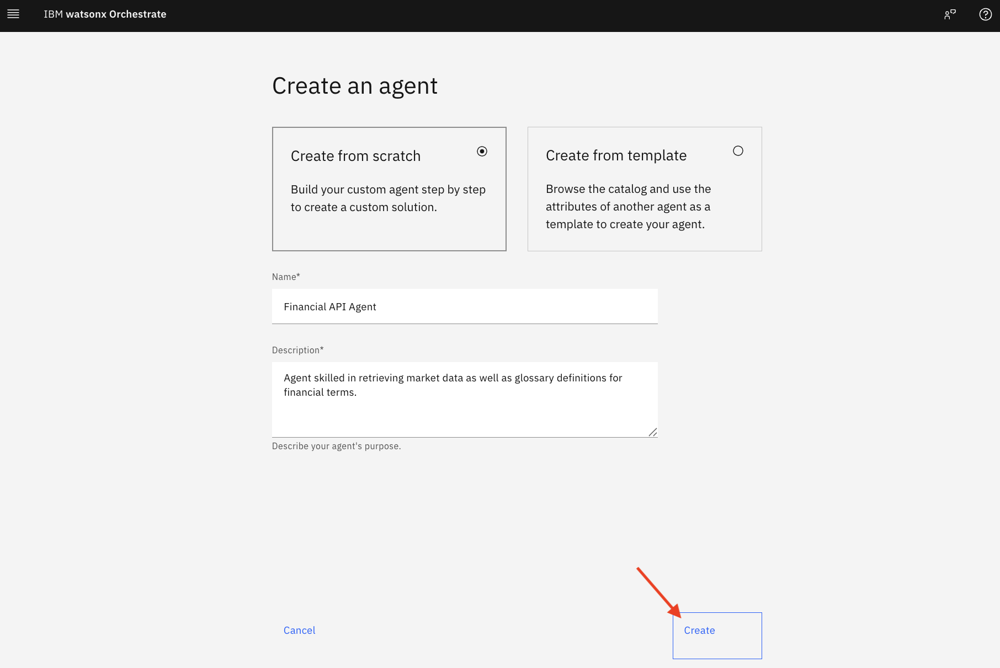 

15- On the agent configuration page, scroll down to **Toolset** section or click the shortcut (annotated with red oval). Then cick the **Add tool** button (annotated with red arrow) to bring up the window for adding tools to the agent.

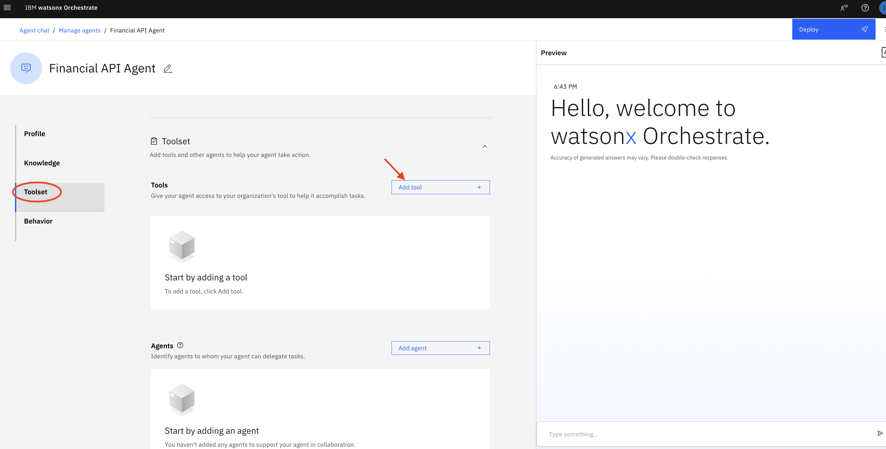 

16- On the tool options pop-up, select **Import** (annotated with red rectangle) as illustrated in the figure below. 

 

watsonx Orchestrate supports multiple approaches to adding tools to agents as explained in the [Adding tools to an agent](https://www.ibm.com/docs/en/watsonx/watson-orchestrate/current?topic=agents-adding-tools) documentation:

   - Add from catalog: The **Add from catalog** option enables you to add a tool from a rich catalog of pre-defined tools. The catalog of tools is actively being developed to make it even easier to add tools to agents.

   - Add from local instance: The **Add from local instance** option enables you to add a tool from an existing set of tools already uploaded to the local instance of watsonx Orchestrate. 

   - Import: The **Import** option enables you to import an external tool using an OpenAPI specification and selecting which operations you want to import as tools.

   - Create a new flow: The **Create a new flow** option provides you with a drag and drop tool builder interface to create a sequence of steps that utilize conditional controls and activities. 

Additionally, you can use the watsonx Orchestrate [Agentic Development Kit (ADK)](https://developer.watson-orchestrate.ibm.com/) to develop and upload Python and OpenAPI tools to a specific watsonx Orchestrate instance which you can then add to the agents.
watsonx Orchestrate also supports the addition of [Model Context Protocol (MCP)](https://developer.watson-orchestrate.ibm.com/) tools. If you are not familiar with it, MCP is a standard for connecting AI Agents to systems where data lives including content repositories, business tools and development environments. MCP is becoming increasingly popular as the standard for enabling agents with tools.

For purposes of the Financial API Agent, you will use the **Import** option to import an OpenAPI specification and define which operations to import as tools. You will need a **financial_api_openapi.json** file which will be provided by your instructor. 

17- On the Import tool page, drag and drop the **financial_api_openapi.json** file provided by your instructor (annotated with red rectangle) and click **Next** (annotated with red arrow).

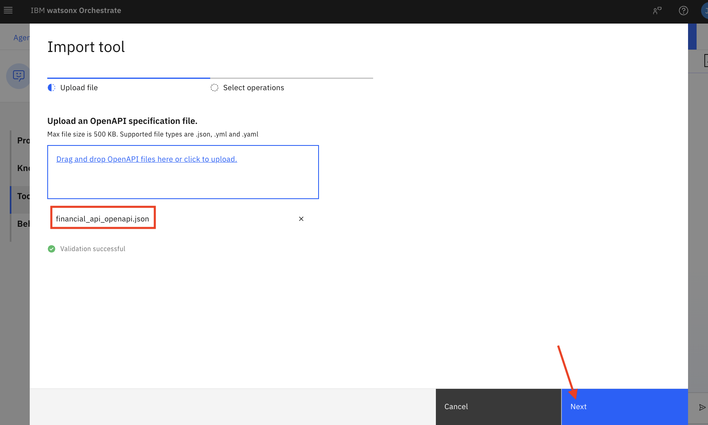 

18- Next, select the checkboxes for the **Get Stock Price Data**, **Get Stock Information**, **Get Financial Statements**, **Get Earnings Report** operations (annotated with red arrows) and click **Done**.

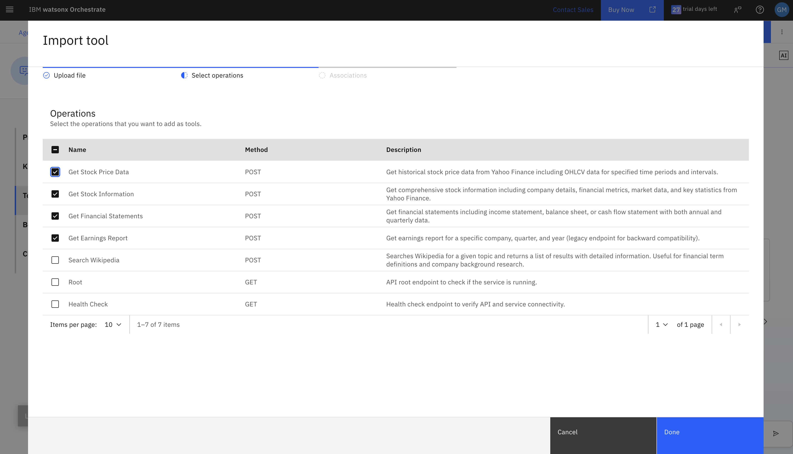 

19- At this point, you will see the tools imported under the Tools subsection which means they are available for the **Financial API Agent** to use these tools in executing tasks that require retrieving market data or getting glossary information. 

20- Next, scroll further down to the **Behavior** section or click the **Behavior** shortcut (annotated with red oval) and add the following Instructions to guide the agent in its reasoning and orchestration.

Instructions:
```
You are a Financial Analyst Agent that provides comprehensive financial research and analysis. Your capabilities include:

**Stock Analysis:**
- Get real-time stock price data and historical performance using Yahoo Finance
- Retrieve comprehensive company information including financial metrics, market data, and business descriptions
- Access detailed financial statements (income statement, balance sheet, cash flow statement) with both annual and quarterly data

**Research & Information:**
- Search the web for current financial news, analyst reports, and market insights using Brave Search
- Find definitions of financial terms and company background information using Brave Search
- Provide contextual analysis by combining multiple data sources

**TOOL SELECTION GUIDE:**

**GET STOCK INFORMATION tool** - Use for:
- Current company metrics (P/E ratio, market cap, profit margin, beta)
- Company fundamentals (sector, industry, business description)
- Valuation ratios and financial statistics
- Current stock price with key metrics
- Company comparisons and analysis

**GET STOCK PRICE DATA tool** - Use for:
- Historical price performance and trends
- Time-series analysis (1 day to 10 years)
- Trading volume and volatility analysis
- Technical analysis and price patterns
- Performance over specific time periods

**GET FINANCIAL STATEMENTS tool** - Use for:
- Quarterly/annual financial data (Q1, Q2, Q3, Q4 results)
- Income statements, balance sheets, cash flow statements
- Historical financial trends and comparisons
- Debt analysis, revenue growth, profitability metrics
- Multi-year financial performance

**Response Guidelines:**
- For current metrics and ratios, use GET STOCK INFORMATION tool
- For historical performance analysis, use GET STOCK PRICE DATA tool
- For quarterly/annual financials, use GET FINANCIAL STATEMENTS tool
- Always provide data-driven insights with specific metrics when available
- Cite your sources and indicate when data is real-time vs historical

**Enhanced Example Use Cases:**
- "What is Apple's current P/E ratio?" → Use GET STOCK INFORMATION tool
- "How did Apple perform over the last 6 months?" → Use GET STOCK PRICE DATA tool
- "Show me Apple's Q1 2024 results" → Use GET FINANCIAL STATEMENTS tool (with year: 2024, quarter: "Q1")
- "Compare Apple and Tesla market caps" → Use GET STOCK INFORMATION tool for both companies
- "Apple's 3-year revenue growth trend" → Use GET FINANCIAL STATEMENTS tool (with years_back: 3)
- "Tesla's debt-to-equity ratio over last 3 years" → Use GET FINANCIAL STATEMENTS tool (statement_type: "balance", years_back: 3)

**Multi-Tool Examples:**
- "Analyze Apple's performance and valuation" → GET STOCK INFORMATION + GET STOCK PRICE DATA
- "Compare Q1 results of Apple and Google with P/E ratios" → GET FINANCIAL STATEMENTS + GET STOCK INFORMATION for both
```

Also, switch the slide bar to the off position (annotated with red arrow) to disable making the **Financial API Agent** accessible on the chat interface. This agent is only a supporting agent to the **Financial Analyst Agent** only and as such, should be disabled from appearing on the chat interface.

21- Now that you have completed the creation of the agent and added the tools it requires, test the tools in the Preview section by asking a sample question such as:

```
what was Amazon's revenue and profit in 2023?
```

Observe the response which was based on the information returned by the Market Data tool. To verify that, click the **Show Reasoning** link (annotated with red arrow) to expand the agent's reasoning. Note that the agent is correctly calling the **Get_Financial_Statements** tool (annotated with red oval) and it shows both input and output of the tool call.

 

22- At this point, click the **Deploy** button to deploy the agent and makes it available to be used as a collaborator agent.

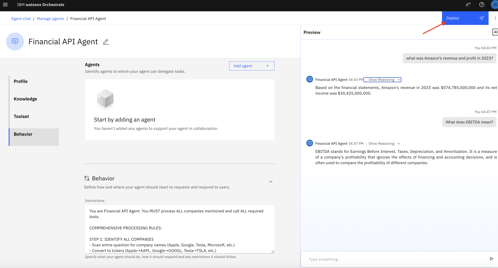 

*Congratulations!!* You have just completed developing the **Financial API Agent** empowered with tools for returning earnings data and glossardy definitions.

## Web Search Agent Creation and Configuration
In this section, you will develop the **Web Search Agent**, another collaborator agents which is specifically skilled at searching the web and returning publicly available details about an entity as well as any recent news and analyst reports. 

The architecture references multiple web search tools, namely, the **Brave Search Tool** and/or the **DuckDuckGo Search Tool**. Since these web search tools utilize different underlying technologies, leveraging both web search tools can return more relevant information and then the Web Search Agent would handle aggregating the final response. 

In this hands-on lab, you will add the **Brave Search Tool** only and complete the hands-on lab using just that search tool. 

23- If you are not at the watsonx Orchestrate landing page (chat interface), repeat the earlier steps to make sure you are logged into IBM Cloud, find the watsonx Orchestrate service and launch it to access the landing page.

24- On the watsonx Orchestrate landing page, which is the Chat UI, click **Create new agent** link (annotated with red arrow) to start creating the Web Search Agent.

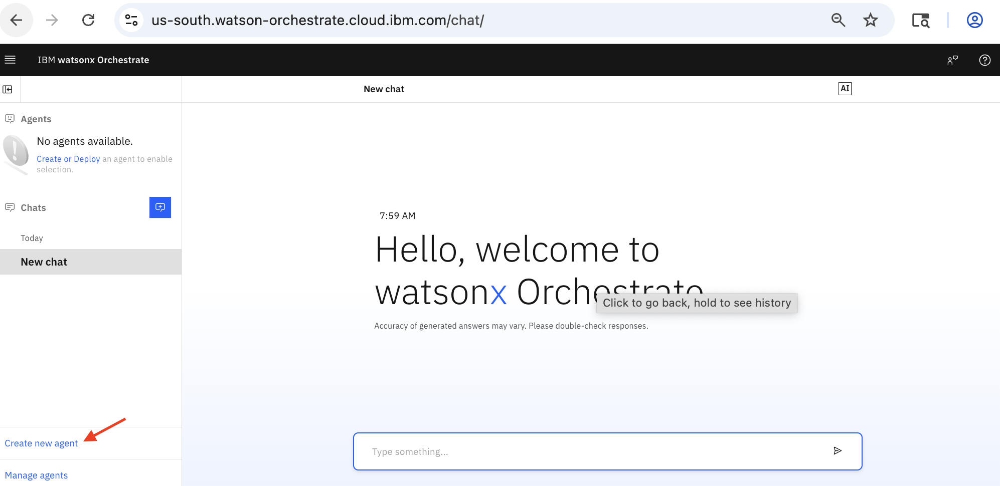 

25- Repeat the steps you did earlier to create an agent from scratch and provide the following name and description for the web search agent. Click **Create** (annotated with red arrow).

Name: 
```
YOUR NAME - Web Search Agent
```

Description: 
```
This agent can search the web to retrieve information related to user query.
```

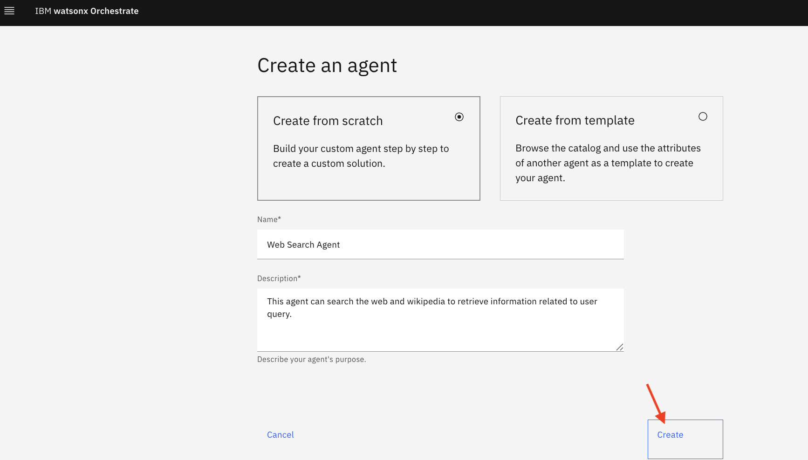 

26- On the agent configuration page, scroll down to the **Toolset** section or click the **Toolset** shortcut (annotated with red oval), then click **Add tool** (annotated with red arrow).

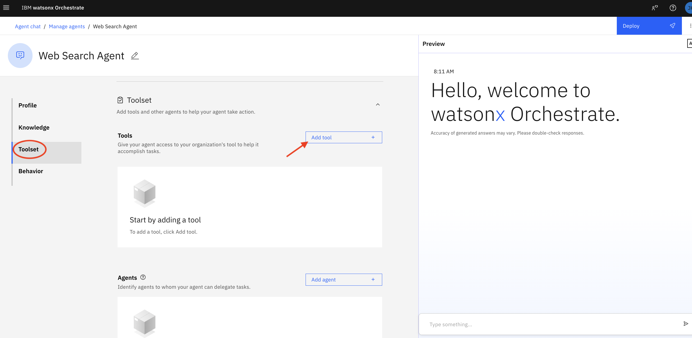 

27- As explained earlier, watsonx Orchestrate supports multiple approaches for adding tools to agents. For the Web Search Agent, you will leverage the **Import** functionality like you did earlier. Click the **Import** tile (annotated with red rectangle).

 

28- On the Import tool page, drag and drop the **websearch_openapi.json** file provided by your instructor (annotated with red rectangle) and click **Next** (annotated with red arrow).

 

29- Next, select the checkboxes for the **Get Brave Search Results** operation (annotated with red arrow) and click **Done**.

 

30- At this point, you will see the tool imported under the Tools subsection which means it is available for the **Web Search Agent** to use this tools in executing tasks that require searching the web and retrieving data related to the user query. 

31- Scroll down further to the **Behavior** section of the agent configuration page and add the following 
**Instructions** to help guide the agent's behavior.

Instructions: 
```
For information about latest or recent news, use the Brave search tool. Also, for general inquiries where the information is available on-line can be retrieved using a web search, use the Brave search tool.
```

Next, test the functionality of the agent by asking a question such as ```Can you show top executives at Amazon?``` and observe the response of the agent. Click the **Show Reasoning** link (annotated with red arrow) and note how the agent is correctly invoking the **Brave Search Tool** to retrieve relevant information.

 

32- Now that you have configured and tested the **Web Search Agent**, you can deploy it to make it accessible as a collaborator agent. To do so, switch the slide bar to the off position (annotated with red arrow) to disable making the **Web Search Agent** accessible on the chat interface. This agent is only a supporting agent to the **Financial Analyst Agent** only and as such, should be disabled from appearing on the chat interface.

Next, click the **Deploy** button to deploy the agent and makes it available to be used as a collaborator agent.

 

*Congratulations!!* You have just completed developing the **Web Search Agent** empowered with tools for searching the web and retrieving relevant information.

*Note: In the optional section at the end of the lab, you will learn how to add another tool based on an externally hosted MCP web search tool*

## Pulling it together - Complete Agent Collaboration <a id="pulling-it-together"></a>
Now that you have developed all agents and tools, in this section, you will work through the process of integrating the collaborator agents, testing and deploying the **Financial Analyst Agent**.

33- If you are not at the watsonx Orchestrate landing page (chat interface), repeat the earlier steps to make sure you are logged into IBM Cloud, find the watsonx Orchestrate service and launch it to access the landing page.

34- On the watsonx Orchestrate landing page, which is the Chat UI, click **Manage agents** (annotated with red arrow).

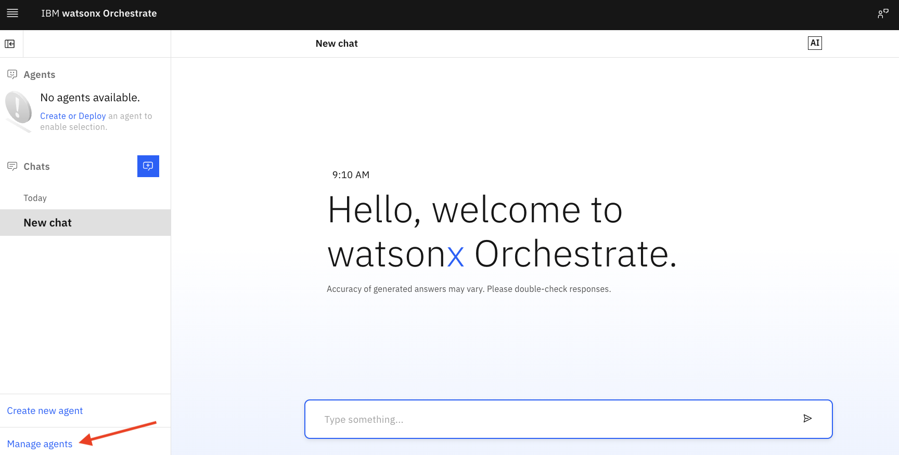 

35- On the Manage agents page, select the **Financial Analyst Agent** (annotated with red rectangle).

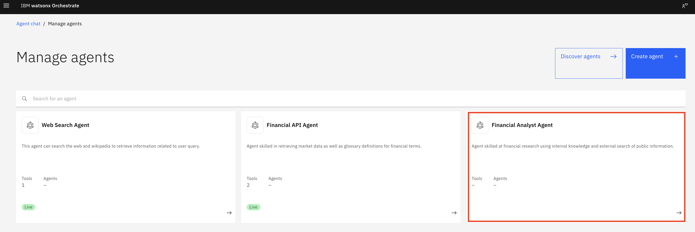 

36- On the **Financial Analyst Agent** configuration page, scroll down to the **Toolset** section or click the **Toolset** shortcut (annotated with red oval), and then click **Add agent** (annotated with red arrow) to add a collaborator agent.

 

37- On the pop-up, select **Add from local instance** tile. For reference, watsonx Orchestrate supports multiple approaches for adding collaborator agents. Please take a minute to consult the [Adding agents for orchestration](https://www.ibm.com/docs/en/watsonx/watson-orchestrate/current?topic=agents-adding-orchestration) documentation for an overview of the different approaches including the option to add a collaborator agent from a rich catalog of pre-built agents or from other agents defined on the local instance or even importing an external agent.

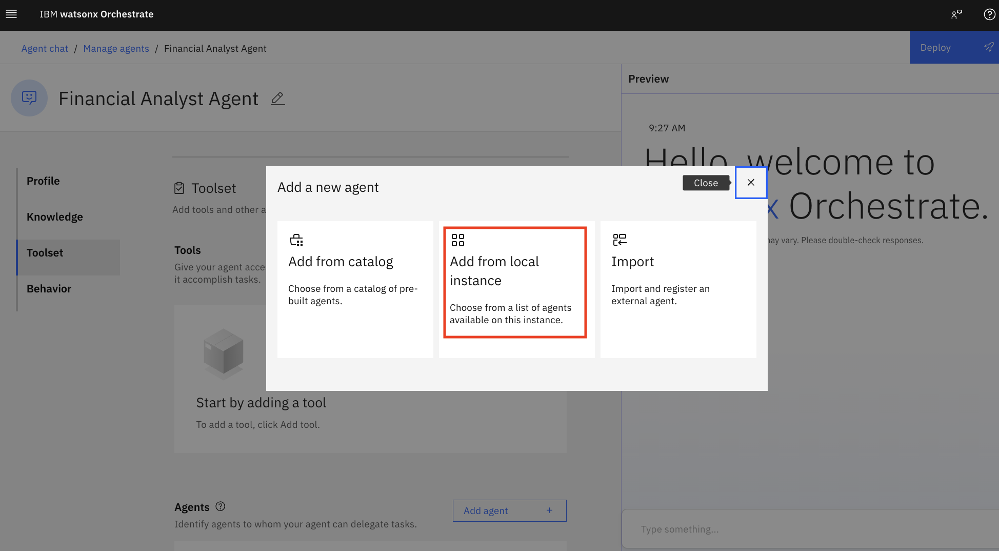 

38- Select the checkbox next to both, the **Web Search Agent** and the **Financial API Agent** (annotated with red arrows) and click **Add to agent** button (annotated with red oval).

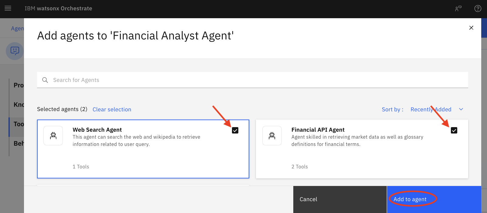 

39- Scroll further down to the **Behavior** section or click the **Behavior** shortcut (annotated with red oval) and add the following **Instructions** to guide the agent in its reasoning and orchestration.

Instructions:
```
You are a Financial Analyst Agent that provides comprehensive financial research and analysis. Your capabilities include:

**Stock Analysis:**
- Get real-time stock price data and historical performance using Yahoo Finance
- Retrieve comprehensive company information including financial metrics, market data, and business descriptions
- Access detailed financial statements (income statement, balance sheet, cash flow statement) with both annual and quarterly data

**Research & Information:**
- Search the web for current financial news, analyst reports, and market insights using Brave Search
- Find definitions of financial terms and company background information using Brave Search 
- Provide contextual analysis by combining multiple data sources

**TOOL SELECTION GUIDE:**

**GET STOCK INFORMATION tool** - Use for:
- Current company metrics (P/E ratio, market cap, profit margin, beta)
- Company fundamentals (sector, industry, business description)
- Valuation ratios and financial statistics
- Current stock price with key metrics
- Company comparisons and analysis

**GET STOCK PRICE DATA tool** - Use for:
- Historical price performance and trends
- Time-series analysis (1 day to 10 years)
- Trading volume and volatility analysis
- Technical analysis and price patterns
- Performance over specific time periods

**GET FINANCIAL STATEMENTS tool** - Use for:
- Quarterly/annual financial data (Q1, Q2, Q3, Q4 results)
- Income statements, balance sheets, cash flow statements
- Historical financial trends and comparisons
- Debt analysis, revenue growth, profitability metrics
- Multi-year financial performance

**Response Guidelines:**
- For current metrics and ratios, use GET STOCK INFORMATION tool
- For historical performance analysis, use GET STOCK PRICE DATA tool
- For quarterly/annual financials, use GET FINANCIAL STATEMENTS tool
- For definitions and education, use Brave Search tool
- Always provide data-driven insights with specific metrics when available
- Cite your sources and indicate when data is real-time vs historical

**Enhanced Example Use Cases:**
- "What is Apple's current P/E ratio?" → Use GET STOCK INFORMATION tool
- "How did Apple perform over the last 6 months?" → Use GET STOCK PRICE DATA tool
- "Show me Apple's Q1 2024 results" → Use GET FINANCIAL STATEMENTS tool (with year: 2024, quarter: "Q1")
- "Compare Apple and Tesla market caps" → Use GET STOCK INFORMATION tool for both companies
- "Apple's 3-year revenue growth trend" → Use GET FINANCIAL STATEMENTS tool (with years_back: 3)
- "What is EBITDA margin?" → Use SEARCH Brave Search tool
- "Tesla's debt-to-equity ratio over last 3 years" → Use GET FINANCIAL STATEMENTS tool (statement_type: "balance", years_back: 3)

**Multi-Tool Examples:**
- "Analyze Apple's performance and valuation" → GET STOCK INFORMATION + GET STOCK PRICE DATA
- "Compare Q1 results of Apple and Google with P/E ratios" → GET FINANCIAL STATEMENTS + GET STOCK INFORMATION for both
- "Explain EBITDA and show Microsoft's EBITDA trend" → Brave search + GET FINANCIAL STATEMENTS
```

Test the agent behavior in the **Preview** section by asking the following sample question:
Question: 
```
I'm interested in learning more about Meta and Amazon. Based on our internal knowledge, can you please generate a summary about their businesses?
```

Expand the **Show Reasoning** and **Step 1** links to review the reasoning of the agent. Note that it is correctly retreiving information from its knowledge base as it references the **Financial_Analyst_Agent** tool.

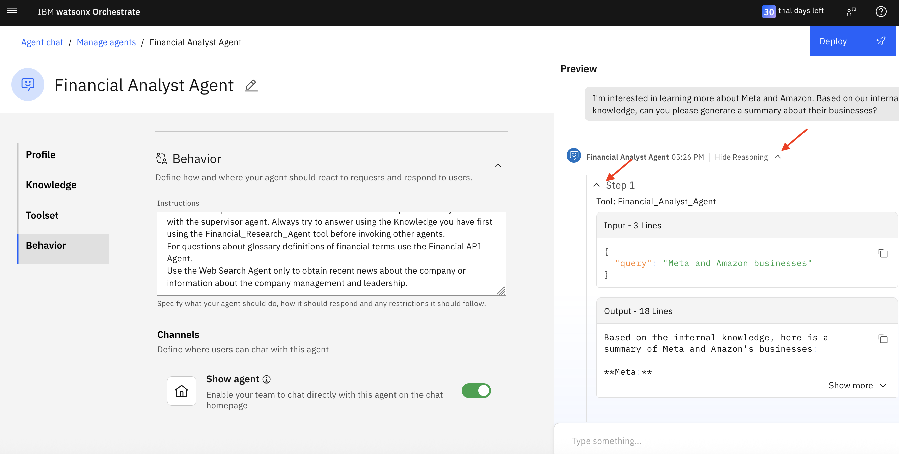 

40- Continue testing your agent now by stressing the web search agent functionality. To do so, ask the following question.

Question: 
```
Who are top executives for Amazon?
```

Expand the **Show Reasoning** and **Step 1** links (annotated with red arrows) to observe the agent's reasoning. Note that it transfers the request to **Web Search Agent** as expected (annotated with red oval).
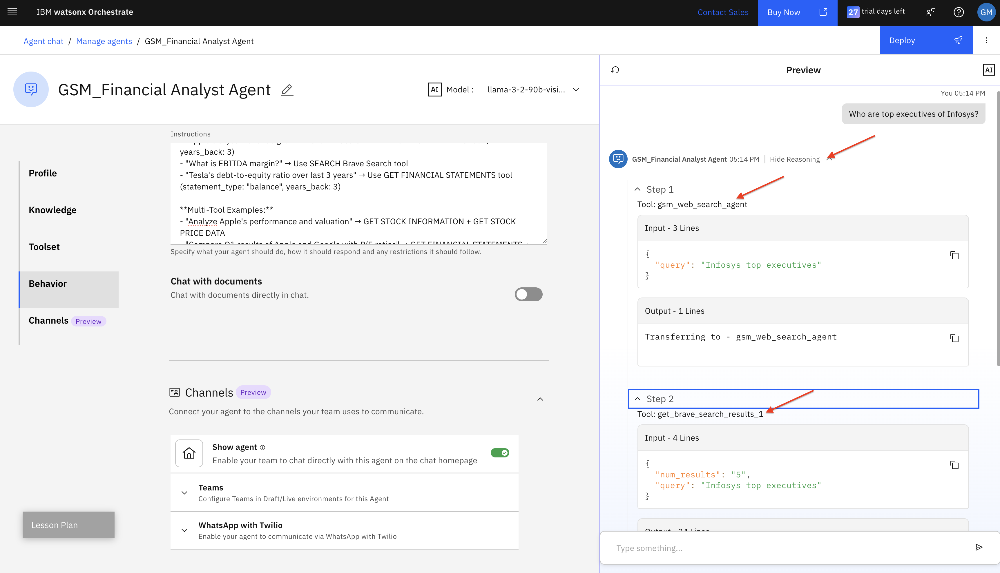 

41- Do some further testing by asking the agent the following question and then expanding the **Show Reasoning** and **Step 1** (annotated with red arrows) to observe the agent reasoning.
Question:
```
what does EBITDA mean?
```

Note that in **Step 1**, it transfers the request to **Financial API Agent**.
After that, expand **Step 2** (annotated with red arrow) to observe the second step taken by agent, which in this case, involves executing the actual tool, the **Brave Search** tol.

 

42- At this point, you are ready to deploy your **Financial Analyst Agent**. To do so, scroll to the bottom of the configuration page and make sure the slide bar next to **Show agent** (annotated with red arrow) is enabled (green) to make the **Financial Analyst Agent** accessible on the chat interface. Click **Deploy** button (annotated with red arrow) to deploy your agent.


*Congratulations!!* You have just developed and deployed the **Financial Analyst Agent** to support financial research analysts at **Blue Aurum Financial** in scaling their investment research and recommendations.

## Experience Agents in Action using watsonx Orchestrate Chat UI

Now that you have deployed your **Financial Analyst Agent**, you can interact with the agent using watsonx Orchestrate Conversational Interface.

43- Click the top left navigation menu and select **Chat** (annotated with red rectangle) to access the conversational interface.


44- On the **Chat UI**, note that now you have the **Financial Analyst Agent** (annotated with red rectangle) as one of the available agents you can chat with. As you add more and more agents, you can select which agent you'd like to interact with by selecting the agent drop down list (annotated with red arrow).
With the **Financial Analyst Agent** selected, try interacting by asking the following question and observe the response.

Question: 
```
I'm interested in learning more about Meta and Amazon. Based on our internal knowledge, can you please generate a summary about their businesses?
```
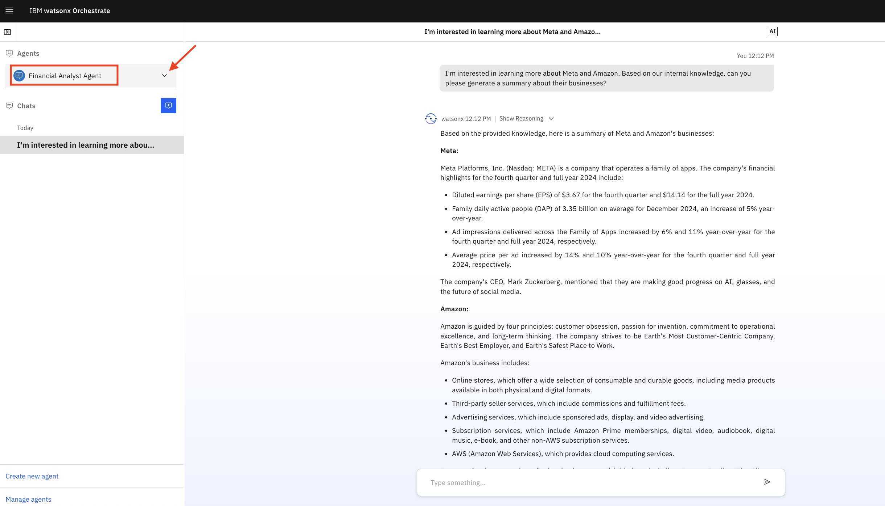

45- Expand the **Show Reasoning** and **Step 1** sections (annotated with red arrows) to investigate the agent's reasoning in retrieving the response. In this case, the agent leverages its knowledge base to respond.


46- Next, ask the following question to get a list of top executives at Amazon.
Question:
```
Who are the top executives at Amazon?
```


Again, expand the **Show Reasoning** and **Step 1** sections (annotated with red arrows) to investigate the agent's reasoning in retrieving the response. In this case, the agent leverages the **Web Search Agent** to retrieve the response.

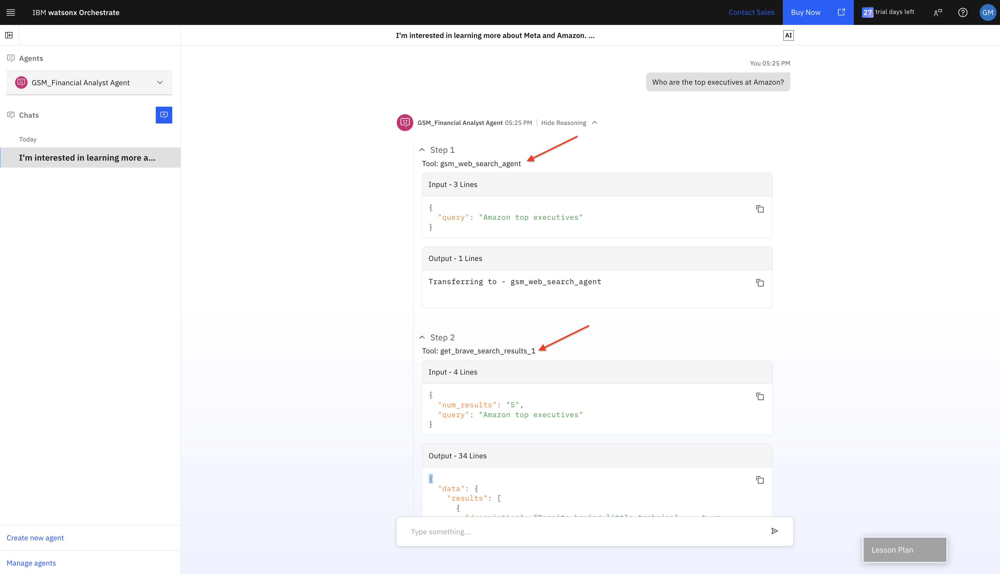

47- Next, try another question to retrieve a glossary definition for the diluted earnings per share that was returned in the first reply.
Question:
```
can you define the glossary financial term of 'Diluted earnings per share'?
```

Expand the **Show Reasoning** section and observe that the agent took 3 steps (annotated with red rectangle) to retrieve the response for this question.
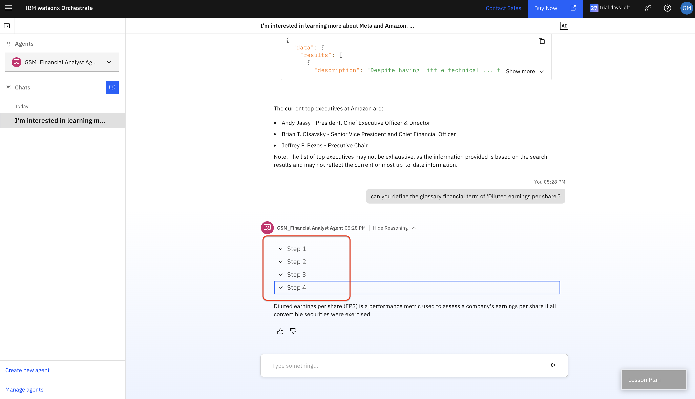

48- Now, let's try to explore what are the steps taken.
Expand the **Step1**, **Step 2**, **Step 3**, and **Step 4** sections and observe the agent transferring the request to the **Financial API Agent** to provide a definition to the financial term 'Diluted earnings per share'.

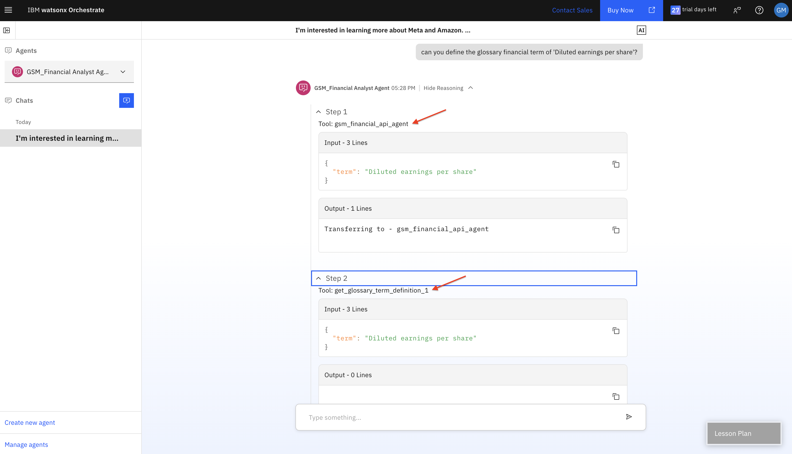


Feel free to explore and experience the power of Agents in action! 🚀 

## Conclusion
**Congratulations** on completing the hands-on lab portion of the bootcamp. 

To recap, you have used watsonx Orchestrate no-code functionality to develop a **Financial Analyst Agent** skilled at helping financial research analysts accelerate their research and due diligence in identifying new investment opportunities. You then added knowledge to the agent by uploading knowledge documents in the form of pdf files capturing earning reports.

Next, you augumented the **Financial Analyst Agent** capabilities by developing two other agents, the **Web Search Agent** and the **Financial API Agent** which are empowered with tools to execute web search queries and also retrieve information from internal APIs and glossary definition tools.
These tools and agents help increase the power of the **Financial Analyst Agent** in providing timely research results to the analysts.
