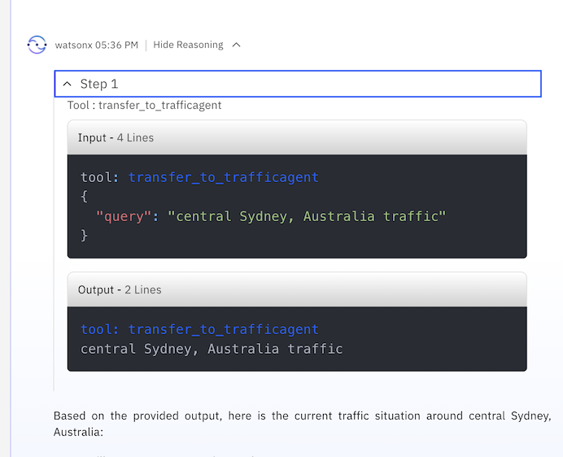

# Use case: Intelligent AI Assistant

## Table of Contents

- [Use case: Intelligent AI Assistant](#use-case-intelligent-ai-assistant)
  - [Table of Contents](#table-of-contents)
  - [Introduction](#introduction)
    - [Pre-requisites](#pre-requisites)
  - [watsonx Orchestrate](#watsonx-orchestrate)
    - [The watsonx Orchestrate console](#the-watsonx-orchestrate-console)
    - [AI Agent Configuration](#ai-agent-configuration)
    - [The Dock Status Agent](#the-dock-status-agent)
    - [The Surplus Agent](#the-surplus-agent)
    - [The Secretary Agent](#the-secretary-agent)
    - [The Traffic Agent](#the-traffic-agent)
    - [The Warehouse Manager Agent](#the-warehouse-manager-agent)
  - [Summary](#summary)

## Introduction
This use case describes a scenario where a user leverages an AI agent via chat / natural language interface, to help with the execution of tasks that require the selection of the right agent to satisfy each request.
Agents can be configured in the system to address specific needs of the organization. Based on the descriptions given, these agents will be selected if they satisfy the task at hand.
Each agent, in turn, is connected with a Large Language Model (LLM) that supports function calling, so that it can leverage one or more tools, again based on each tool's description.

In our scenario, we will build agents for Dock Status, Surplus Handling, Secretary functions and finally Traffic information, all connected to a "routing agent" that will take requests from the end user and then select the appropriate agent for excecution before returning the answer. The flow of interacion we are simulating is one where a Warehouse Manager is asking for dock status, requests for recommendations on the handling of any surplus product, notifies the right set of stakeholders and also keeps an eye on the traffic around the warehouse.

There is an argument to be made that a truly agentic solution would show a high degree of autonomy. To address a particular problem, or ask, an agentic solution will make a plan, execute this plan, check its effectiveness towards a good outcome, and possibly revise the plan as needed, all in an automated fashion and without human intervention. Applying that to the flow described above, we can simply take out the "human in the loop", by letting the system analyze the status of the dock, decide what to do with surplus product, notify stakeholders of the decision (say, return surplus to original warehouse), and update systems of record. At the same time, we can have a "human in the loop", whereby the Warehouse Manager invokes every step along the way, checking the response from the respective agent to ensure the right progression.

<div style="border: 2px solid black; padding: 10px;">
Even though we will take you through a complete and working example, you should also consider making changes that fit your desired use case, and only take this description as a reference point that guides you along your own implementation.
</div>

### Pre-requisites

- Check with your instructor to make sure **all systems** are up and running before you continue.
- If you're an instructor running this lab, check the **Instructor's guides** to set up all environments and systems.

## watsonx Orchestrate

As shown in the [Solution Architecture](./images/Intelligent%20Assistant%20Architecture.jpeg), we will build and deploy the majority of the agents for the solution in watsonx Orchestrate.

To get to the watsonx Orchestrate console, go the [Resources list on the IBM Cloud homepage](https://cloud.ibm.com/resources).


Expand the `AI / Machine Learning` section and select the resource that has `watsonx Orchestrate` in the Product column, as shown above. Next, click on the `Launch watsonx Orchestrate` button.


This opens the watsonx Orchestrate console.


### The watsonx Orchestrate console

> When opening the console for the very first time, you may be greeted by a pop-up window offering that you create your first agent. Click on `Skip for now`.


In the console, it shows that no agents have been deployed yet. Thus, if you interact with watsonx Orchestrate at this point, not much will happen, since the system has no agents available to route any request to.

However, you can already interact with the Large Language Model (LLM) that works behind the scenes, and ask general questions, like "How are you today?" or "What is the capital of France?". 


Go ahead and chat with watsonx Orchestrate to explore what type of answers it gives to your questions.

### AI Agent Configuration
We are now ready to build the first agent. In the watsonx Orchestrate console, click on either `Create or Deploy` or `Create new agent` (either will goet you to he same place).

IMPORTANT: You are using a shared environment. While creating the AI agents make sure to add your name as prefix to the agent name i.e. 


### The Dock Status Agent
In the following screen, you can select if you want to create the new agent from scratch or from a template, and give it a name and a description.
To create the solution, you will need to create a number of agents and we will go through them one by one, starting with the `Dock Status` agent. Let's start by giving it a name  and a description:
- Name: Your Name - Dock Status Agent
- Description: 
```
The Dock Status Agent specializes in answering inquiries about current warehouse dock status. It has access to detailed and up-to-date data about which trucks are loading and unloading at docks, and information about the products they carry, and return detailed textual information about this data to the user.
```

Note that in the world of AI Agents, these descriptions are not merely used as documentation, they are also used in making decisions about selecting the right agent for the job, so what you enter into this field is important.

After you have entered the required information, click on `Create`.


On the following screen, we can enter more information about the new agent we are building. Agents can rely on `Knowledge`, on a `Toolset` that consists of one or more `Tools` and one or more `Agents` to satisfy a request that is sent to them, and we can define all of those elements here. 
- `Knowledge` represents information that is stored in the form of "embeddings" in a so-called Vector Store. Whenever the agent answers a request, it can choose to run a search against the connected Knowledge repository (i.e. the Vector Store) to search for information that can assist in answering the request. You can either upload documents directly here, or connect the agent to an already existing repository. Note that once again, the "Description" field is key, because it will help the agent decide whether to run a search against the knowledge.
- The `Toolset` contains other components that the agent can delegate certain tasks to. 
  - `Tools` are functions an agent can call. It can be either an API call or an invocation of custom code. This allows to extend the agent's capabilitiy beyond what the LLM has been trained with.
  - `Agents` are other agents, either within watsonx Orchestrate or running externally, e.g., in watsonx.ai that this agent can delegate the request, or part of a request, to.

In a real production deployment, the Dock Status agent would sit in front of an existing enterprise backend system that can provide up-to-date data about trucks currently sitting at warehouse docks, and keep track of products and their quantity that are being unloaded.
However, in this hands-on exercise, we will simulate that backend by simply hardcoding the data into the `Behavior` field of the agent. The content of this field drive the prompts that are sent to the underlying LLM, and adding the hardcoded data equates to providing examples in the prompt. So, for the purpose of simulating data stemming from an enterprise system, we can use this workaround. Note how the instructions provide detailed information about both the persona and the context this agent operates with.

On the agent definition page, scroll all the way down to the `Behavior` section and copy the following text into the `Instructions` text field:

```
Persona:
- Your purpose is to provide information about warehouse dock status. I will ask about the status at the docks, or one specific dock identified by dock ID, and you will answer in a detailed textual format.

Context:
- Use the Dock status data below to create answers. The data below is formatted in JSON, but you will return the information as text in a bulleted list.
- If no dock ID is specified, return data for all the docks.
- the data is current, no timestamp is required or supported.
- Provide as much detail as you can.

Dock status data:
{
  "dock_id": 1,
  "trucks": [
    {
      "truck_id": "T001",
      "status": "Unloading",
      "ETA": "2 hours",
      "details": {
        "SKU": "199464599",
        "Payload_Quantity": 250,
        "Surplus_Status": "Received surplus"
      }
    },
    {
      "truck_id": "T002",
      "status": "Unloading",
      "ETA": "1.5 hours",
      "details": {
        "SKU": "226814212",
        "Payload_Quantity": 150,
        "Surplus_Status": "No Surplus"
      }
    },
    {
      "truck_id": "T003",
      "status": "Unloading",
      "ETA": "1 hour",
      "details": {
        "SKU": "404108299",
        "Payload_Quantity": 200,
        "Surplus_Status": "No Surplus"
      }
    }
  ]
},
{
  "dock_id": 2,
  "trucks": [
    {
      "truck_id": "T004",
      "status": "Unloading",
      "ETA": "1.5 hours",
      "details": {
        "SKU": "102209199",
        "Payload_Quantity": 50,
        "Surplus_Status": "Received surplus"
      }
    },
    {
      "truck_id": "T005",
      "status": "Unloading",
      "ETA": "2 hours",
      "details": {
        "SKU": "148183199",
        "Payload_Quantity": 80,
        "Surplus_Status": "No Surplus"
      }
    }
  ]
}
```


Finally, make sure you uncheck the `Show agent` checkbox, as shown in the picture below. This switch controls whether the agent is available in the main chat window. We only want to expose the top level agent (which we haven't created yet) there. 


Let's now test the new agent. In the Preview window, enter a question for the agent, for example "Can you tell me about the status of the warehouse docks?" Note how the agent is using the provided data to formulate its answer. Also, experiment asking the agent to format the output as table.


> When doing this in your own instance, you may see answers that differ from the ones shown in the screenshot above. Moreover, the agent will often ask follow-up questions before offering an answer. This is due to the undeterministic nature of the AI models involved. Feel free to experiment with different types of questions to see how the agent reacts. The same equally applies to all the agents described further down.

You can now go ahead and deploy the agent, using the `Deploy` button at the top right of the page.


Now let's go back to the Agents list on the Manage agents page, by clicking on the `Manage agents` link at the top left of the page.


Note how the Dock Status Agent now shows a small green icon saying "Live". This indicates successful deployment of the agent.

### The Surplus Agent

This agent analyzes options for the handling of surplus product, and makes recommendations for how to handle it. Surplus product can be routed to a variety of places, all of which incur different cost. Just like in the previous example, a real system would be connected to a separate application that handls this analysis, and here we are just going to simulate it. We will use the same approach as with the Dock Status Agent, namely add the hardcoded data to the Behavior field.

In the Manage agents view, click on the `Create agent` button.


Now leave the `Create from scratch` option selected, enter "Surplus Agent" as the name and enter the following into the Description field:
```
The Surplus Agent provides recommendations about the handling of surplus data. It has access to data including the allocation strategy, product SKU and total cost for the surplus on each truck, and it returns information about the recommended handling of surplus.
```


Then click on `Create`.

In the following view, scroll all the way down to the `Behavior` section, and enter the following into the `Instructions` field:
```
Persona:
- Your purpose is to provide information about surplus. I will ask about the recommended handling of surplus on a specific truck, and you will answer in a detailed format with the allocation strategy based on the given data, along with truck id, Product SKU, total cost, surplus unit.

Context:
- Use the Surplus data below to create answers. The data below is formatted in JSON, but you will return the information as text in a bulleted list.
- If no allocation strategy is specified, return data according to the default allocation strategy given in the data below.
- If no product SKU is provided by the user, return data for all of the product SKUs within a given truck ID.
- Provide as much detail as you can.

Surplus data:
{
  "truck_id": "T004",
  "SKU": "102209199",
  "total_surplus": 15,
  "allocation": [
    {
      "destination": "Marketing",
      "units": 12
    },
    {
      "destination": "Relocation",
      "units": 3
    }
  ],
  "total_cost": 69
},
{
  "truck_id": "T001",
  "SKU": "199464599",
  "total_surplus": 50,
  "allocation": [
    {
      "destination": "Holding",
      "units": 15
    },
    {
      "destination": "Marketing",
      "units": 19
    },
    {
      "destination": "Relocation",
      "units": 12
    },
    {
      "destination": "Dropship",
      "units": 4
    }
  ],
  "total_cost": 684
}
```

Uncheck the Show agent checkbox, just like you did for the Dock Status agent.


Before deploying this new agent, we can test its functionality by entering requests in the Preview window. For example, you can ask 
```
How do we handle the surplus on truck T001?
```


Once you are satisfied with the result, click on the `Deploy` button to deploy this agent, and then click on the `Manage agents` link to return to the agents overview page.

You should now see two agents listed, and both should have the "Live" indicator.


### The Secretary Agent

Creating yet another agent should work like a breeze for you now! We want an agent that handles communication with stakeholder, including sending out notifications about surplus handling. The process will be exactly the same as with the previous two agents, and we will once again provide output examples in the `Instructions` field.

Click on Create agent and enter the following:
- Name: Secretary Agent
- Description: 
```
The Secretary Agent specializes in creating emails related to warehouse topics. 
```

Then click on Create and add the following text to the `Instructions` field in the Behavior section:
```
Persona:
- Your persona is that of a secretary that drafts emails. I will ask you to create an email about a topic, and you will return a textual draft of that email.

Context:
- Write a concise and professional draft email about the surplus in the inventory.   The email should directly begin with the subject line, followed by the email body without any introductory statements or preambles. 
- Use your knowledge of email writing as a guide to structure and tone, but do not limit yourself to specific teams or predefined examples.  
- Assume the audience and content are general unless specified otherwise.  
- Avoid mentioning any knowledge limitations or referencing specific teams unless explicitly required. 
- Below are examples of user prompts and the resulting generated email as guidance for your own generations.  

Examples:
Example1:
Input: 
Generate a notification email for the marketing team for item 223456789 for 25 units
Output:
Subject: Notification of Surplus Units for SKU# 223456789 

Marketing Team,
This email is to inform you that there are 25 surplus units of item 223456789 available. Please review and coordinate any necessary marketing efforts for these additional units.

Warehouse Management

Example2:
Input:  Generate a notification email for the holding team for item 112334343 for  10 units
Output:

Subject: Notification of Surplus Units for SKU#112334343

Holding Team,
This email is to notify you that there are 10 units of item 112334343 in surplus which need to be stored in the inventory. Please take necessary actions.

Warehouse Management

Example3:
Input:  Generate a notification email for the dropship team for SKU: 88245464599 of 10 units
Output:
Subject: Notification of Surplus Units for SKU#88245464599

Dropship Team,
This email is to notify you that there are 10 units of item 88245464599 in surplus. Please review and adjust shipping schedules as needed to accommodate these additional units.

Warehouse Management


Example 4:
Input:   Generate a notification email for the relocation team for SKU: 765004599 of 9 units
Output: 
Subject: Notification of Surplus Units for SKU#765004599

Relocation Team,
This email is to notify you that there are 9 units of item 765004599 in surplus. Please review and coordinate any necessary relocation efforts for these additional units.

Warehouse Management
```

Uncheck `Show agent`. Then test the new agent with the Preview, for example, enter "Generate a notification email for the marketing team for SKU: 8932464599 of 10 units". The result should look like in the picture below.


Make sure you click the `Deploy` button again and return to the agent overview window by clicking the `Manage agents` link at the top left of the window.

### The Traffic Agent

Almost there! For this agent, we need to retrieve up-to-date traffic information about a given location. And for this, we will delegate the work to an agent that was developed using Python code and the LangGraph framework, deployed in watsonx.ai. The creation of this agent is not subject of this lab, but will be covered in a separate lab in the future. 
Here, you will be given the details for the agent by your instructor, who has pre-deployed the agent for you. So there is nothing else to do here for now.

### The Warehouse Manager Agent

We are finally ready to create the agent that acts as the orchestrator for all other agents and is the agent the end user interacts with. 

Click on `Create agent` once more. 


Like the other agents you created already, this one will be created from scratch. The name is "Warehouse Manager Agent". The description differs from the previous agents, indicating that this one is an 'orchestrating', or 'supervising', or 'routing' agent: 
```
The Warehouse Manager Agent is in charge of routing user requests to the most relevant agent working under it.
``` 

After you have entered the information, click on `Create`.


We had mentioned above that an agent can collaborate with other agents to fulfill a certain task. You enter those collaborator agents in the `Agents` section under `Toolset` in the agent definition window.


Click on the `Add agent` button. Since we want to add the agents you created above as collaborators to this agent, select the `Add from local instance` option.


Here you see all three agents listed that you have created. We want all of them to be used by the Warehouse Manager Agent, so check everyone of them and click on `Add to agent`. Note that it is possible that you will see more than the three agents covered in this lab (you may have created agents from a different lab, or created some of your own), so make sure you are selecting the right set of three.


But we are not done yet. Click on `Add agent` again. This time, select the `Import` option. This will allow us to import the agent from watsonx.ai.


On the next screen, select the `External agent` option and click on `Next`.


On the following screen, enter details about the imported agent:
- Agent details
  - Provider: `watsonx.ai`
  - Authentication type: leave as `API key`
  - API key: enter the key provided to you by your instructor
  - Service instance URL: enter the value provided to you by your instructor
- Define new agent
  - Display name: `NAME-TrafficAgent` (the name cannot contain a space)
  - Description of agent capabilities: `The TrafficAgent agent provides information about traffic in any given location.`


Now click on `Import agent`. You should now see all four agents listed in the Toolset section of the Warehouse Manager Agent.


Finally, we give this agent instructions about how to use the collaborator agents we defined earlier. Enter the folllowing text in the `Instructions` field under Behavior.
```
Reasoning:
- Use the Dock Status Agent for tasks related to dock status.
- Use the Surplus Agent for tasks related to surplus.
- Use the Secretary Agent for drafting of emails.
- Use the TrafficAgent to find traffic information about a location.
```

Before we test this agent, scroll all the to the bottom and make sure the `Show agent` checkbox is actually checked! This is the agent we want to use in the main chat window and make it available to end users.


Let's test it. Since we haven't touched it before, let's start with the externale TrafficAgent agent. We can trigger it by asking about traffic in a given location, say, Sydney Australia. Enter the following into the Preview text input: "Please tell me about traffic around central Sydney, Australia." (You can obviously pick any other location, too.)


Note that the agent was "reasoning", in other words, determining how to answer this request. It decided that routing the request to the TrafficAgent was the best option. You can expand the `Show reasoning` section in the Preview and see which steps the agent took. It should list one step, which you can expand as well.



Note how it selected the Traffic agent to answer the request, which was obviously the right choice in this case.

You can now test the routing to the other agents, possibly using the same or similar prompts as what you used earlier to test them individually:
- "What is the status of the warehouse docks?"
- "How do we handle surplus on truck T001?"
- "Please create a notification email ..."
  


Once you are satisfied with the answer, deploy this agent using the `Deploy` button as with the other agents before. Since we left the `Show agent` option checked, we can now go back to the home screen to see it there. Simply click on `watsonx Orchestrate` at the very top of the window.


Now you can enter your questions and requests in the main chat window. Note how the Warehouse Manager agent is already preselected under the Agents list on the left (it is the only agent appearing in that list anyway). You can use the same questions you asked when testing the individual agents above.
 


We encourage you to explore the behavior of the solution further, by asking more "loaded" questions, which involve more than one agent to answer. For example, you could ask "Please tell me about the status of the warehouse docks and let me know what to do with surplus if there is any." Note how you may get asked follow-up clarification questions by the agent, to retrieve more specific information, for example, which exact truck ID you are asking about.
What this is trying to show is how you can send fairly detailed questions and instructions to an agent, but you can also give it more autonomy in how to address a request, by involving multiple agents and tools.


Congratulations! You have create a complete agentic AI solution, without writing a single line of code! 

## Summary

In this lab, we went through the use case of an operational manager at a warehouse, which uses an agentic solution to handle arriving and possibly surplus products. We started by creating a number of agent for tasks like dock status retrieval or surplus analysis. For one aspect, we imported an external agent running in watsonx.ai. Finally, all of it came together in the orchestrating agent that serves as the main frontend.

After we had all configured to be used by the AI Agent chat, we can interact with the solution through the main chat interface, and the system will execute and delegate to the appropriate agent.

Note that the intention of this exercise is to provide you with a starting point. Some parts of this solution are simulated, and would have to be fully implemented for a real solution. Moreover, a true agentic solution would add a reasoning layer on top of what you have built here, which allows coming up with a plan for handling, in this case, warehouse situation autonomously, making its own decisions along the way. We believe that those solutions are yet to become real.

But hopefully it triggered some ideas for you about how to leverage AI agents in your business environment.
