# Deploy the AskHR Backend Application Manually

These instructions will walk you thru the process to deploy the askhr [backend application](./HCM_APP) manually within **IBM Cloud Serverless Containers (Code Engine)**. 

1. Navigate to [IBM Cloud](cloud.ibm.com).

   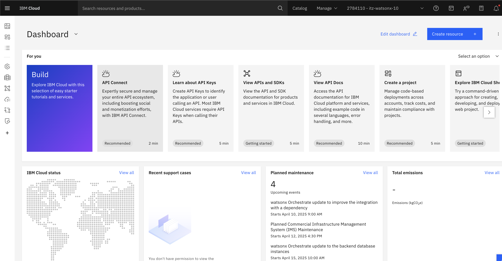

1. Click on the hamburger menu in the top left and then select **Resource List**.

   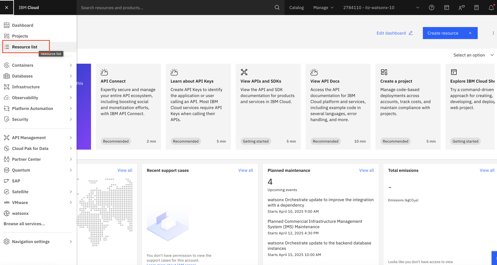

1. This will show you a list of available resources in your instance. Select **Containers**, which will give you a list of products. Choose the **Code Engine** product.

   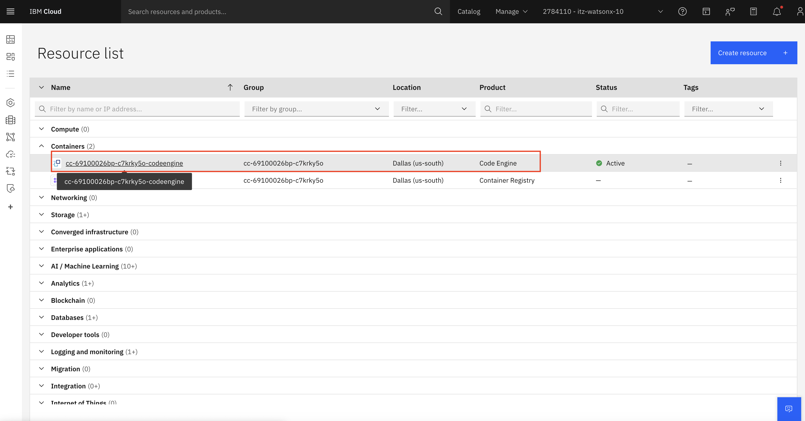

1. This is **Code Engine** project homepage.
   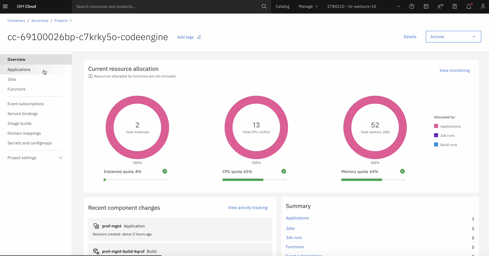

1. Create Registry and SSH secrets. For those steps go [here](../../environment-setup/common/Readme.md)

1. Create the Application. From menu, click on "Applications", then click on "Create".
   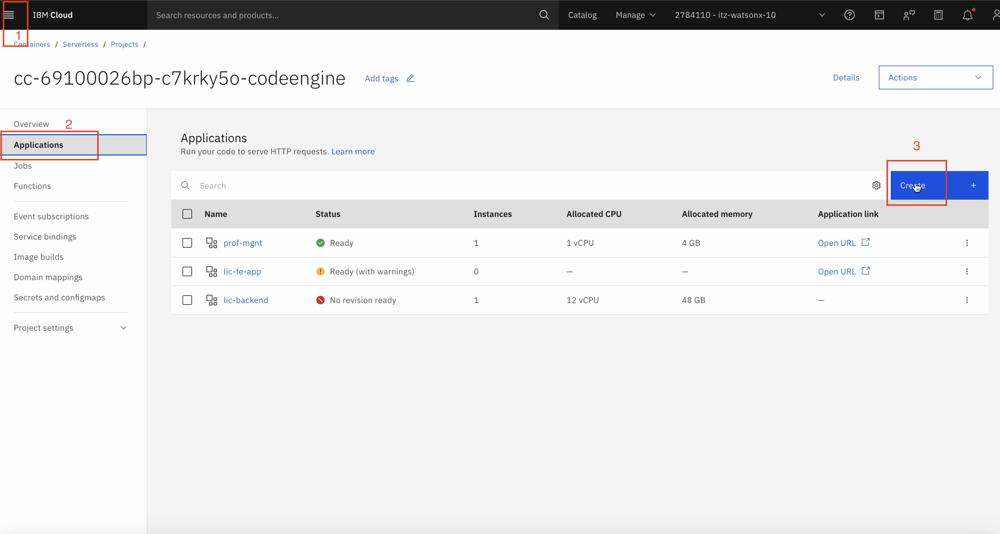

1. Give your application a name, i.e. `hr-skills-app`. Select "Build container image from source code" under Code section. Paste `git@github.ibm.com:skol/agentic-ai-client-bootcamp-instructors.git` in "Code repo URL" field.
Then click on "Specify build details"
   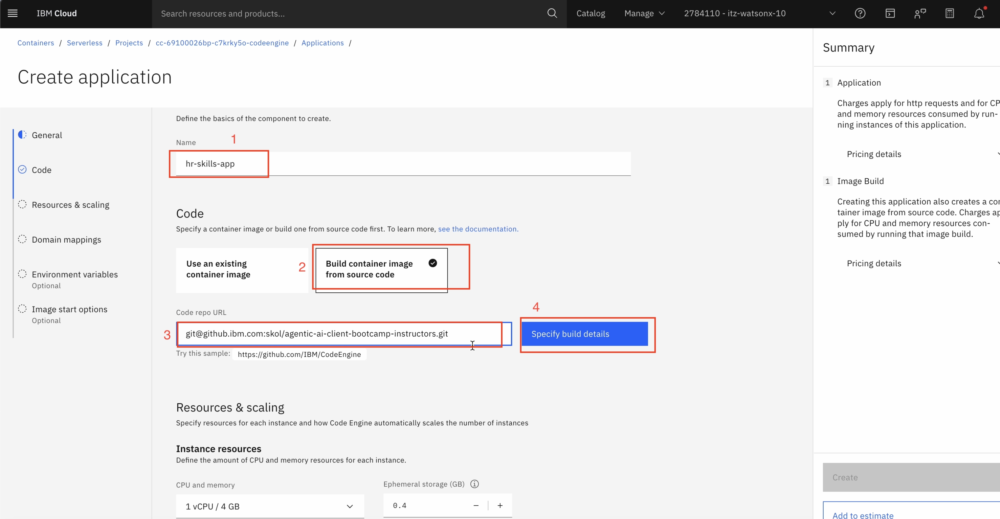

1. In "SSH secret" field, you have to select your ssh secret that you created in Step 5 to access the Github repository. In "Branch name" field, type `main` or whatever branch you want to deploy from. In "Context directory" field, put `usecase-setup/askhr/HCM_APP`. Finally click on "Next".
   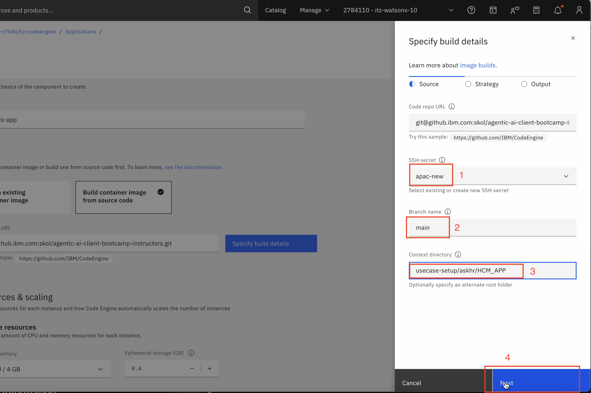

1. In next step, select Strategy `Dockerfile`, keep Timeout `40m`. In "Build resources", select `M(1 vCPU / 4 GB)` from dropdown. Then click on "Next"
   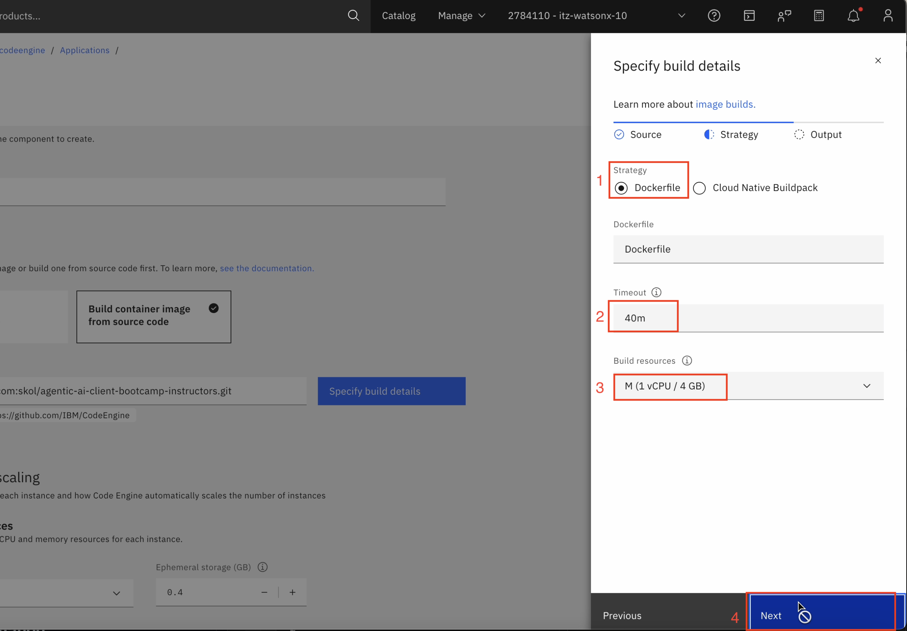

1. Select available registry server from dropdown in "Registry Server" field, In "Registry secret" field, select your registry secret that you created in Step 5. "Namespace" field will be automatically filled, otherwise you can select one from dropdown. 
Give your Repository (image) a name, in "Tag" section, type `latest`. Finally click on "Done".
   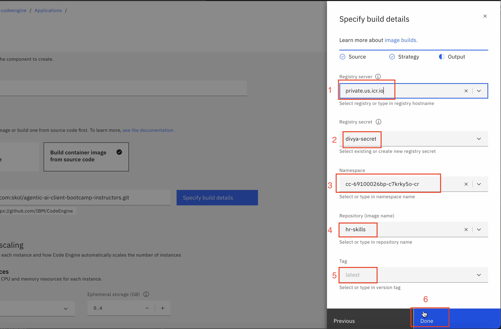

1. Scroll down a bit. Increase "Min number of instances" to 1. 
   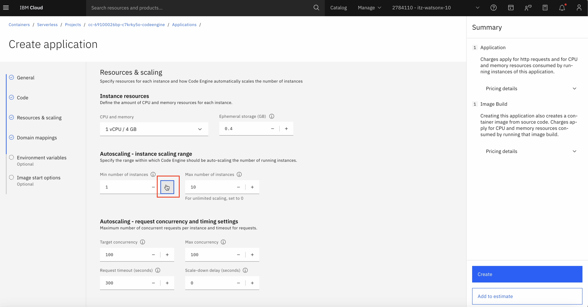

1. Select "Public" in Domain mappings.
   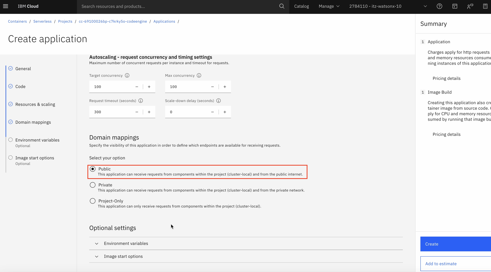

1. In "Image start options", under "Listening port", edit the value from `8080` to `8000`.
   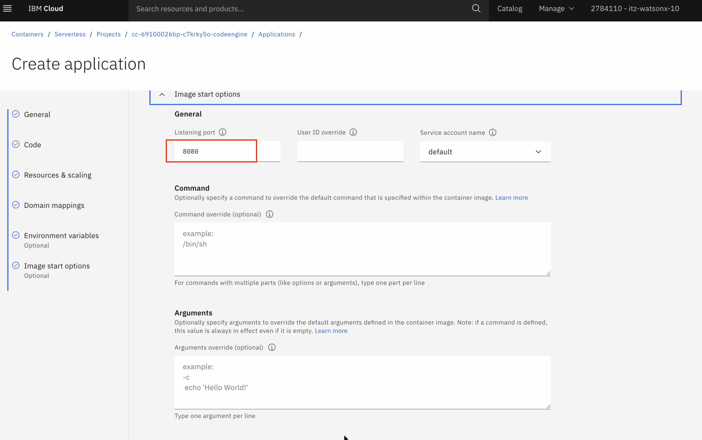

1. Click on "Create" in right.
   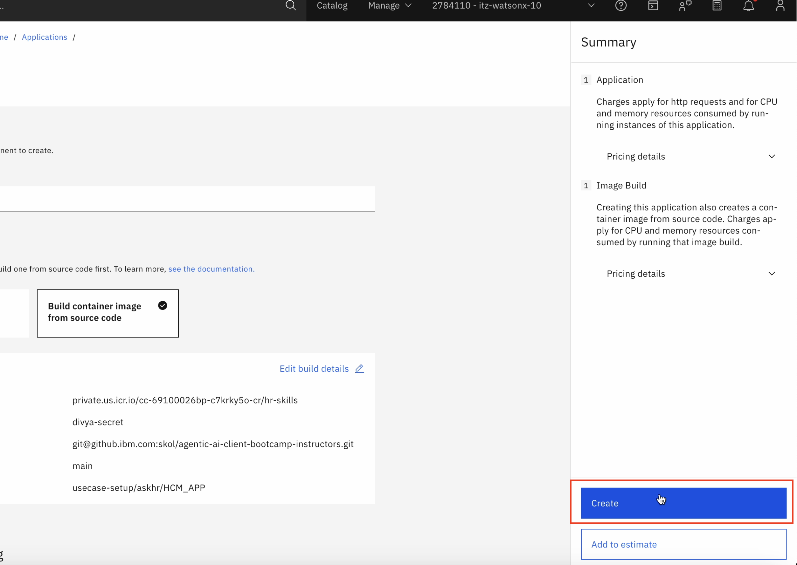   

1. Wait for the status to change to "Ready". Once its ready, click on the application.
   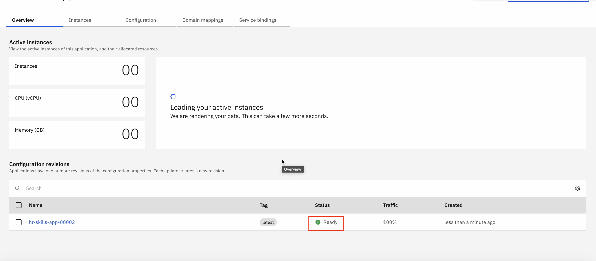

1. Click on "Test application".
 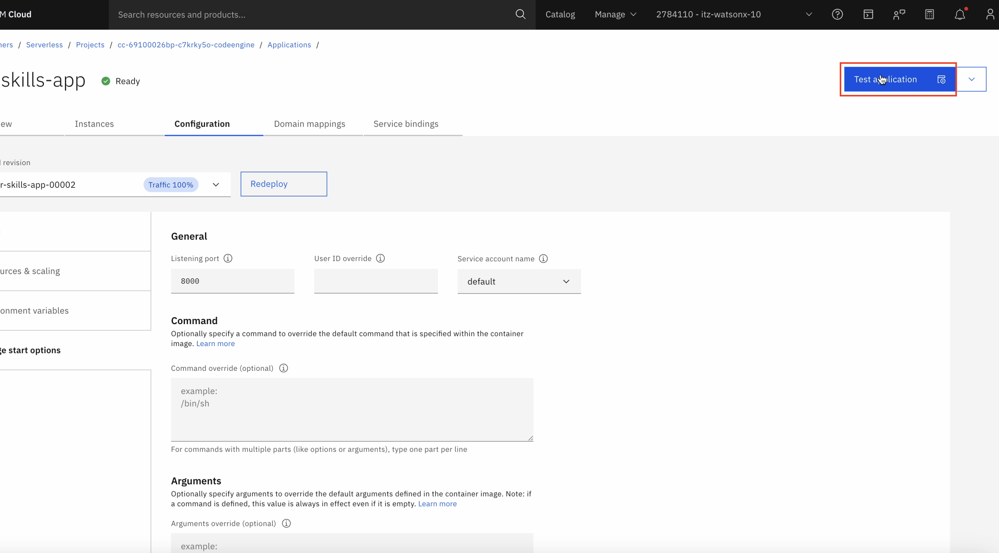

1. Click on "Application URL". You'll be directed to a website. Take note of this URL, you will need it in the final setup steps [here](./README.md#3-update-api-spec-file-with-deployment-url)
   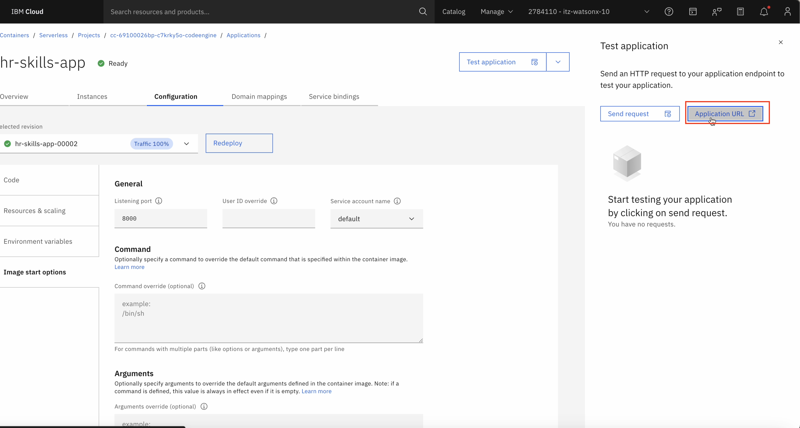   
