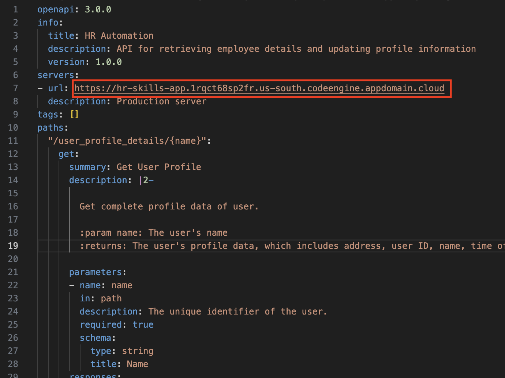

# Ask HR – Backend App Deployment Details  

⚙️ This use case simulates interactions with an HR system or database, allowing the user to update employee information or request time off. 

## Deployment Information
To simulate the HR system, a backend application will be deployed and interacted with. This application will host APIs that can be used as tools in your agents. You can find the backend application script [here](./HCM_APP/prof_mgmt.py). 

The [App Deployment Guide](#app-deployment-guide) section shows you how to set this up.

## API Documentation

The OpenAPI specification [(hr.yaml](./HCM_APP/hr.yaml)) provides API details that can be imported into Watsonx Orchestrate.

## App Deployment Guide
The backend application service will be deployed on **IBM Serverless Containers (Code Engine)** and the build image created in **IBM Container Registry**. 

### Prerequisites
- Create an unencrypted [SSH key](../../environment-setup/common/sshkey.md) (without a passphrase) and save the public key in your `github.ibm.com` user settings
- Create an [IBM Cloud API key](../../environment-setup/common/apikey.md) for the TechZone Cloud account

### 1. Reserve a techzone cloud environment

Reserve the techzone instance that includes **watsonx.ai**, **watsonx Orchestrate**, **Code Engine** and **Container Registry**. 
For details, go [here](../../environment-setup/readme.md). For instructor setup make sure to reserve a single environment.

### 2. Deploy application
#### Manual deployment

For manual steps to deploy the backend application go [here](DEPLOY_MANUAL.md). Take note of the deployment URL.

#### Testing the APIs
Once the application is deployed, you can see what APIs are available by going to `<app_url>/docs`.

### 3. Update API spec file with deployment URL
An OpenAPI specification ([hr.yaml](./HCM_APP/hr.yaml)) is provided with details that will point to the deployed backend `hr-skills-app` application APIs.

Replace the URL of deployed `hr-skills-app` application (noted in step 2) in `hr.yaml` file as shown in image below. 
  
 
**NOTE: You will need to provide this updated `hr.yaml` spec file to participants.**

## Default app data
The backend application contains a common set of pre-defined hard-coded user details. **The instructor should share one user name with each of the bootcamp participants** which they will use when testing their transactions, as to not overwrite each participant's interactions.

**Note**: Using names outside this will result in errors or exceptions.

To get the list of already present user names in database, download it from [here](/usecase-setup/askhr/HCM_APP/users_data.xlsx)

| Name                   | TimeOffBalance | Job                                           | Address                                                      | RequestedTimeOff |
| ---------------------- | -------------- | --------------------------------------------- | ------------------------------------------------------------ | ---------------- |
| Daniel Anderson        | 28.61          | Chartered legal executive (England and Wales) | 383 Alisha Pine Suite 655, Lake Brandonland, LA 05900        | 10               |
| William Frazier        | 13.34          | Primary school teacher                        | 7071 Richmond Stream, North Lisa, PR 29260                   | 19               |
| Danielle Hall          | 10.06          | Magazine journalist                           | 90610 John Turnpike, Josephchester, UT 23589                 | 18               |
| Diane Conrad           | 43.88          | Cartographer                                  | 394 Miranda Burgs Apt. 445, Chavezborough, MO 37370          | 15               |
| Maria Mcdowell         | 10.71          | Chief of Staff                                | 6099 Gina Hill Apt. 258, South Ericaberg, TN 21770           | 21               |
| Mrs. Karina Williamson | 41.09          | Chief Financial Officer                       | 374 Seth Trafficway, New Makayla, MS 30134                   | 11               |
| Jacob Graham           | 15.04          | Designer, furniture                           | 10384 Jesse Plaza, East Danny, UT 07253                      | 10               |
| Jessica West           | 14.2           | Exercise physiologist                         | 11471 Christopher River Suite 073, Clarkhaven, VT 91906      | 12               |
| Rebekah Valdez         | 1.76           | Nurse, adult                                  | 63875 Gregory Manors, Port Jennifer, OH 59157                | 26               |
| Yvonne Clark           | 7.4            | Restaurant manager                            | 8204 Jacobson Hills, New Madison, TN 14193                   | 18               |
| Victoria Baker         | 44.28          | Designer, jewellery                           | 43546 Michael Trace Suite 285, Kennedyfurt, NC 22812         | 21               |
| James Harding          | 25.06          | Planning and development surveyor             | 0017 Leblanc Turnpike, East Johnny, IL 35091                 | 24               |
| Thomas Anderson        | 44.13          | Pension scheme manager                        | 8912 Morse Greens, Paynestad, ME 14640                       | 11               |
| Jennifer Rivers        | 19.88          | Chief of Staff                                | 75901 Clay Parks Apt. 314, Rogersfort, WY 11746              | 10               |
| Sarah Boyle            | 37.59          | Agricultural engineer                         | 231 Sophia Drives Suite 667, Torresside, ND 87160            | 25               |
| Mary Pruitt            | 48.32          | Audiological scientist                        | 4901 Williams Views Apt. 146, Fitzgeraldfurt, IL 06883       | 23               |
| Laura Escobar          | 17.44          | Sports therapist                              | 6231 Veronica Bridge, Seanshire, MP 47693                    | 11               |
| Becky Simmons          | 2.78           | Armed forces technical officer                | 0652 Cook Road Suite 722, Rushbury, WV 08848                 | 29               |
| Tracey Brown           | 43.95          | Clinical molecular geneticist                 | 530 Hansen Highway Apt. 812, East Kristen, ND 29791          | 18               |
| Sean Lang              | 43.71          | Dietitian                                     | 0943 Kaiser Neck, North Maxwell, PA 67942                    | 21               |
| Michael Miller         | 26.52          | Materials engineer                            | 8744 Sandra Corners, Waltersfurt, CA 07789                   | 25               |
| Victor Vincent         | 8.99           | Surveyor, planning and development            | 973 Shaw Village Suite 608, Nicholasside, HI 37194           | 30               |
| Anthony Underwood      | 46.48          | Garment/textile technologist                  | 9773 Fisher Path, Bowmantown, ME 52339                       | 25               |
| Kathleen Fowler        | 1.31           | Surveyor, planning and development            | 8387 Cheryl Island Suite 769, Debrafurt, NJ 86139            | 14               |
| John Garcia            | 11.89          | Clinical cytogeneticist                       | USCGC Barrett, FPO AA 25746                                  | 26               |
| Tracy Melton           | 15.99          | Engineer, mining                              | 225 Larry Crescent, Port Debbie, NH 90649                    | 20               |
| Allison Stevens        | 16.95          | Clinical biochemist                           | 0214 Stafford Cape, Montesfort, PR 07933                     | 14               |
| Robert Martin          | 5.26           | Architect                                     | 2198 Joseph Via Suite 708, Simpsonland, KY 14140             | 28               |
| John Smith             | 16.97          | Theatre manager                               | 098 Kara Course Suite 316, Carolynport, WA 94969             | 25               |
| Curtis Hunter          | 8.96           | Development worker, international aid         | 9020 David Squares Apt. 200, East Alexander, AR 85219        | 14               |
| Roy Andrews            | 44.52          | Pharmacologist                                | PSC 9483, Box 5134, APO AP 44198                             | 26               |
| Frank Melendez         | 16.94          | Equality and diversity officer                | 17544 Shannon Course, East Bruceshire, WY 39838              | 15               |
| James Davies           | 40.33          | Aeronautical engineer                         | 0363 Lawrence Square Suite 305, Ramirezstad, MN 40558        | 21               |
| Jessica Cole           | 27.88          | Financial manager                             | PSC 3473, Box 3456, APO AE 80628                             | 20               |
| Gerald Pollard         | 14.86          | Illustrator                                   | 6868 Jennifer Springs, Sanchezton, VT 28166                  | 23               |
| Tony Tanner            | 17.2           | Financial manager                             | 6832 Adams Mills Apt. 078, Lake Tinabury, NJ 76213           | 15               |
| Erin Anderson          | 20.22          | Clinical cytogeneticist                       | PSC 6508, Box 6671, APO AE 17304                             | 15               |
| Blake Hernandez        | 49.58          | Magazine journalist                           | 9230 Bryan Trail Apt. 168, Evelynville, HI 78623             | 26               |
| Bethany Nichols        | 33.85          | Office manager                                | 9486 Lester Spur, Huberbury, FL 91495                        | 10               |
| Renee Doyle            | 42.93          | Conservation officer, historic buildings      | 13847 Dillon Islands Suite 363, Lake Matthewside, MO 05101   | 12               |
| Michael Dominguez      | 44.95          | Equities trader                               | 89926 Giles Turnpike Apt. 174, South Cassandrastad, NJ 41871 | 11               |
| Veronica Harrell       | 26.64          | Hydrographic surveyor                         | 883 Elizabeth Manors Suite 950, Diazfurt, NV 95910           | 20               |
| Laura Richard          | 47.82          | Diplomatic Services operational officer       | 7968 Rios Rest Suite 396, Monicaton, VT 55885                | 18               |
| Deborah Bryant         | 25.75          | Ergonomist                                    | 76734 Corey Park, Davidside, RI 06348                        | 20               |
| Kevin Kelley           | 18.1           | Youth worker                                  | 795 Donald Ways, Kimshire, FM 78898                          | 10               |
| Danielle Davis         | 48.1           | Higher education careers adviser              | 188 Amanda Club, Thomasstad, CT 28765                        | 10               |
| Kenneth Perkins        | 18.26          | Senior tax professional/tax inspector         | 5011 Jones Neck, Susanberg, CA 62141                         | 17               |
| Beth Carter            | 41.46          | Geologist, engineering                        | 520 Frazier Extension, Cainbury, OR 48986                    | 11               |
| Gregory Hughes         | 11.37          | Research scientist (medical)                  | 81871 Fleming Rapids Apt. 413, South Jessica, IL 92193       | 11               |
| Tami Dominguez         | 30.05          | Merchandiser, retail                          | 546 Kellie Orchard Suite 541, Port Kevinhaven, MI 61050      | 13               |

